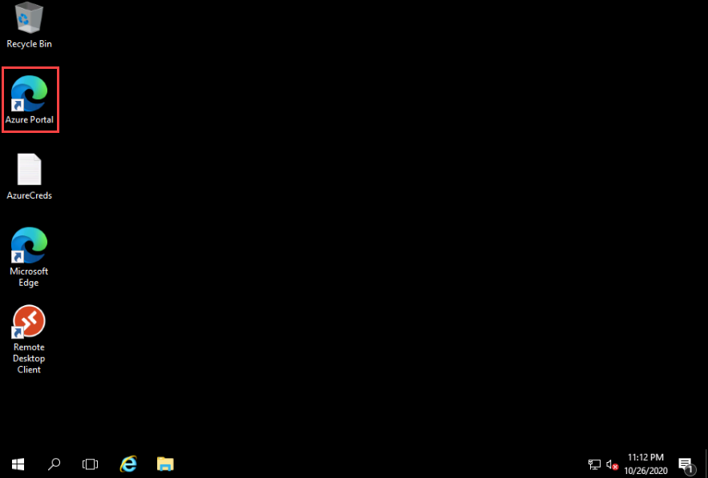
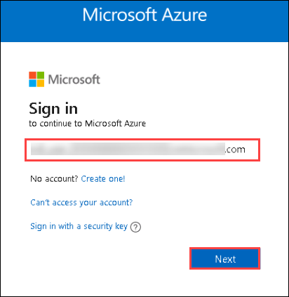
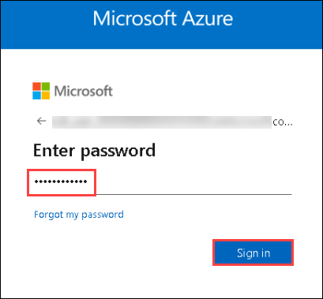
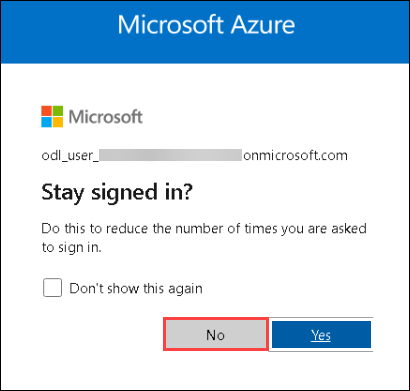

# **Login to Azure Portal**

1. In the JumpVM, double click on the **Azure portal shortcut** on the desktop.

     

2. Login to Azure with the username **<inject key="Demo Admin Username" />** and click on **Next**.

   

3. Enter password **<inject key="Demo Admin Password" />** and click on **Sign in**.

   

> **Note:** If there's a popup entitled **Stay signed in?** with buttons for **No** and **Yes** - Choose **No**.
>
>    
>   
> **Note:** If there's another popup entitled **Welcome to Microsoft Azure** with buttons for **Start Tour** and **Maybe Later** - Choose **Maybe Later**.
>
