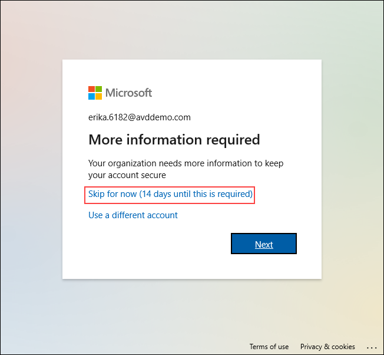
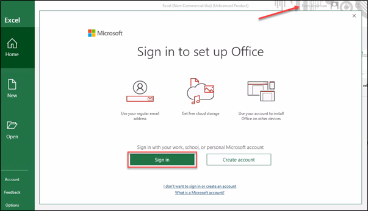

# **Demo 1: AVD Login experience**


## **Task 1: Access the Published Applications and Desktop using Browser**

In this demo, we will access the Desktop and RemoteApps assigned to an end user using a browser.


**Talk through tip:**
   **Mention to the audience:**
 - The user is signing in for the first time. 
 - All the user’s starting with **‘E’** in their first name belongs to **East US** region. 
 - All the user’s starting with **‘C’** in their first name belongs to **Central US** region.

1. Open the below URL for Remote Desktop Web Client in a new browser tab on the JumpVM or your computer. 
      ```
      https://aka.ms/wvdarmweb
      ```

>**Note:** If you are already logged in as the end user, jump to *step 3*.

1. Enter the credentials as below:

   - Enter the username as below and click **Next**.
       ```
       Erika.6182@AVDDemo.com
       ```
   

   
   
   
   - Enter the password and click **Sign in**.
       ```
       cpdz18WCC*Ht!
       ```
   
   


>**Note:** If there's a dialog box with *More information required*, select **Skip for now option**.
>
>


>**Talk through tip:**
> Mention to the audience that the AVD environment is configured to enforce MFA, but for the demo purposes we have allowed the option to Skip the MFA setup for maximum of 14 days.


1. The RemoteApps and the Workspace published to the logged in user will show up, click on **Excel** application to access it.

   
   
1. Select **Allow** on the prompt asking permission to *Access local resources*.

   
   
1. Enter the credentials for **Erika.6182@AVDDemo.com** and click on **Submit**.

   

1. Once signed in, the M365 App will open. The App will be auto activated and Auto logged in using SSO.

   

>**Talk through tip:**
>The first login does SSO in M365 App which also Activates M365 Apps based on the User License.
>On the above screen, if you notice the top right hand side corner; the user is already logged in using SSO.


## **Task 2: Access the Published Applications and Desktop using AVD Client**

In this demo, we will access the Desktop and RemoteApps assigned to an end user using a AVD Client.


1. Launch AVD Client on your JumpVM.

>**Note:** If you are already logged in as the end user, jump to *step 3*.

2. In AVD desktop client click on **Subscribe**.

   

3. Enter the credentials as below:

   - Enter the username as **Erika.6182@AVDDemo.com** and click **Next**.
   

   
   
   
   - Enter the password and click **Sign in**.
   

   


>**Note:** If there's a dialog box with *More information required*, select **Skip for now option**.
>
>

4. The RemoteApps and the Workspace published to the logged in user will show up, click on **Excel** application to access it.

   
   

5. Enter the credentials for *Erika.6182@AVDDemo.com* and click on **Submit**.

   

6. Once signed in, because this is the first login for the user, the M365 Apps will require Activation which is acquired online based on the user licenses, Click on **Sign In**.

   
   
>**Talk through tip:**
>The first login requires M365 App Activation which requires Sign in.
>Even on the above screen, if you notice the top right hand side corner; the user is already logged in using SSO.


7. Upon successful Activation, the user can use the M365 Apps. 

   
