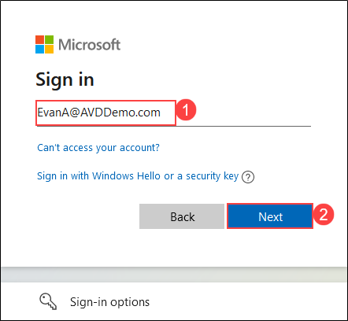
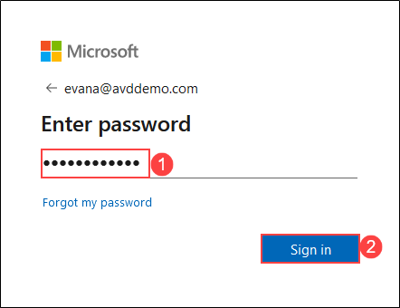

# **Demo 1: AVD Login experience**

## **Task 1: Access the Published Applications and Desktop using Browser**

In this demo, we will access the Desktop and RemoteApps assigned to an end user using a browser.

>**Talk through tip:**
>
>   **Mention to the audience:**
>
>     - The user is signing in for the first time. 
>     - All the user’s starting with ‘E’ in their first name belongs to East US region. 
>     - All the user’s starting with ‘C’ in their first name belongs to Central US region.

1. Open the URL `https://aka.ms/wvdarmweb` for Remote Desktop Web Client in a new browser tab on the JumpVM or your computer. 

>**Note:** If you are already logged in as the end user, jump to *step 3*.

1. Enter the credentials as below:

   - Enter the username as **EvanA@AVDDemo.com** and click **Next**.

   
   
   
   - Enter the password and click **Sign in**.

   

>**Note:** If there's a dialog box with *More information required*, select **Skip for now option**.
>
>

>**Talk through tip:**
> Mention to the audience that the AVD environment is configured to enforce MFA, but for the demo purposes we have allowed the option to Skip the MFA setup for maximum of 14 days.

1. The RemoteApps and the Workspace published to the logged in user will show up, click on **Excel** application to access it.

   
   
2. Select **Allow** on the prompt asking permission to *Access local resources*.

   
