# **Demo 1: AVD Login experience**


## **Task 1: Access the Published Applications using Browser**

In this demo, we will access the Desktop and RemoteApps assigned to an end user using a browser.


**Talk through tip:**
   **Mention to the audience:**
 - The user is signing in for the first time.  
 - All the user’s starting with **‘E’** in their first name belongs to **East US** region. 
 - All the user’s starting with **‘C’** in their first name belongs to **Central US** region.
 - All the users are licensed with M365 License

1. Open the below URL for Remote Desktop Web Client in a new browser tab on the JumpVM or your computer. 
      ```
      https://aka.ms/wvdarmweb
      ```

   >**Note:** If you are already logged in as the end user, jump to *step 3*.

2. Enter the credentials as below:

   - Enter the username as below and click **Next**.
       ```
       Erika.6182@AVDDemo.com
       ```   

   
   
   
   - Enter the password <inject key="demo Admin Password" /> and click **Sign in**.
   
   


   >**Note:** If there's a dialog box with *More information required*, select **Skip for now option**.
   >

>**Talk through tip:**
> Mention to the audience that the AVD environment is configured to enforce MFA, but for the demo purposes we have allowed the option to Skip the MFA setup for maximum of 14 days.


3. The RemoteApps and the Workspace published to the logged in user will show up, click on **Excel** application to access it.

   
   
4. Select **Allow** on the prompt asking permission to *Access local resources*.

   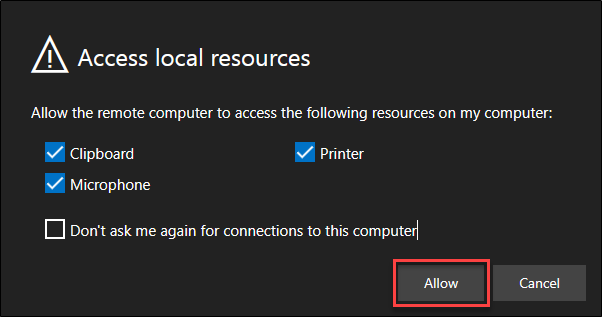
   
5. Enter the credentials for **Erika.6182@AVDDemo.com** and click on **Submit**.

   

6. Once signed in, the M365 App will open. The App will be auto activated and Auto logged in using SSO.

   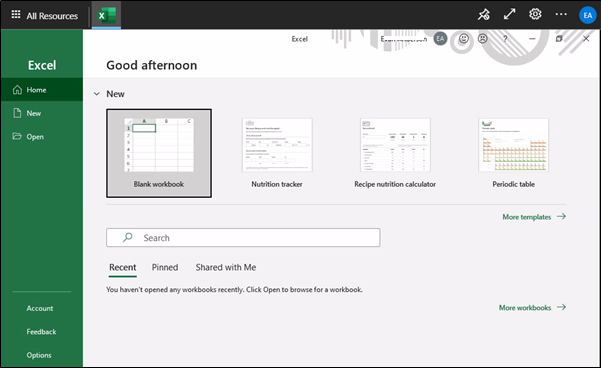

>**Talk through tip:**
>The first login does SSO in M365 App which also Activates M365 Apps based on the User License.
>On the above screen, if you notice the top right hand side corner; the user is already logged in using SSO.


## **Task 2: Access the Published Applications using AVD Client**

In this demo, we will access the Desktop and RemoteApps assigned to an end user using a AVD Client.


1. Launch AVD Client on your JumpVM.

>**Note:** If you are already logged in as the end user, jump to *step 3*.

2. In AVD desktop client click on **Subscribe**.

   

3. Enter the credentials as below:

   - Enter the username as below and click **Next**.
       ```
       Erika.6182@AVDDemo.com
       ```
   

   
   
   
   - Enter the password <inject key="demo Admin Password" /> and click **Sign in**.
   

   


>**Note:** If there's a dialog box with *More information required*, select **Skip for now option**.
>
>

4. The RemoteApps and the Workspace published to the logged in user will show up, click on **Excel** application to access it.

   
   

5. Enter the credentials for *Erika.6182@AVDDemo.com* and click on **Submit**.

   

6. Upon successful Activation, the user can use the M365 Apps. 

   
   
## **Task 3: Access the Published Desktops using Browser**

In this demo, we will access the Desktop assigned to an end user using a browser.

1. Open the below URL for Remote Desktop Web Client in a new browser tab on the JumpVM or your computer. 
      ```
      https://aka.ms/wvdarmweb
      ```

>**Note:** If you are already logged in as the end user, jump to *step 3*.

2. Enter the credentials as below:

   - Enter the username as below and click **Next**.
       ```
       Cody.0629@AVDDemo.com
       ```   

   
   
   
   - Enter the password <inject key="demo Admin Password" /> and click **Sign in**.
   
   

3. The RemoteApps and the Desktops published to the logged in user will show up, click on **SessionDesktop**.

   
   
4. Select **Allow** on the prompt asking permission to *Access local resources*.

   
   
5. Enter the credentials for **Cody.0629@AVDDemo.com** and click on **Submit**.

   

6. Once signed in, the Full Desktop session will be presented to the user through the Browser.

   

## **Task 4: Access the Published Desktops using AVD Client**

In this demo, we will access the Desktop assigned to an end user using an AVD Client app.

1. Launch AVD Client on your JumpVM.

>**Note:** The AVD Client must be already logged in during the previous demo login; follow below steps to login using multiple accounts.

2. In AVD desktop client click on **Subscribe with URL**.

   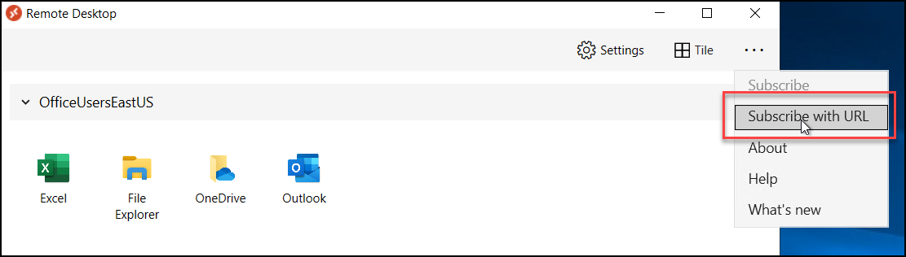

3. - Enter the below feed URL and click **Next**.
       ```
       https://rdweb.wvd.microsoft.com/api/arm/feeddiscovery
       ```   

   

4. - Enter the username as below and click **Next**.
       ```
       Ed.0629@AVDDemo.com
       ```   
   
   - Enter the password <inject key="demo Admin Password" /> and click **Sign in**.

5. The RemoteApps, along with the Session Desktops published to the logged in user will show up, click on **SessionDesktop**.

   
   

6. Enter the credentials for *Ed.0629@AVDDemo.com* and click on **OK**.

7. Once signed in, the Full Desktop session will be presented to the user. 

   

>**Talk through tip:**

>**RDP Ports**
   - Talk about how the client uses HTTPS (outbound) for all the Remote Desktop experience.
   - Explain the NO need of any INBOUND Network Ports.

   

   - Showcase how there are no Public IP Addresses assigned to the VMs running as Session Hosts in AVD.

   

   - Showcase the NSG's on the NICs of the AVD VMs which shows no Inbound ports for RDP or RDGW.

   

>**FSLogix Profiles**
   - The AVD User profiles are being stored in an Azure File Share.
   - We are using FSLogix Container settings to map the User Profiles to Azure Files.
   - East User's profiles are stored in East region and Central User's profiles are stored in Central region.
   - Profiles can be shown from Azure Files using Azure Portal

      - Open any one of the Azure Storage Account in Azure Portal and navigate to **Networking**
      - Add the Public IP to allow list so that the contents of the Azure Files can be accessed from the Portal.

      >**Note:** Azure Files are configured to allow access only from AVD Subnets; hence, to be able to access the Azure Files from Azure Portal, the Public IP that is being used to connect to the Azure Portal needs to be whitelisted.

      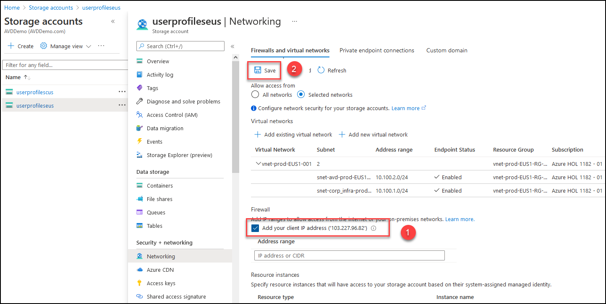

      - Click on **File Shares** and then **upd**; here you will see the User Profiles created for our previous Demo User's Logins.

      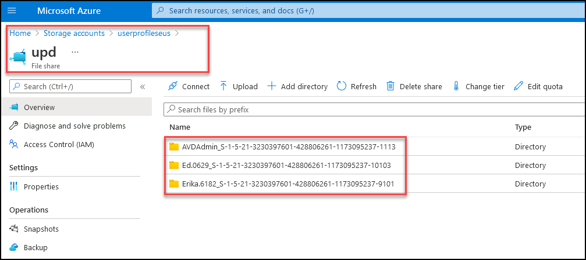
      


## **Task 5: Select Pooled and talk through Breadth-First and Depth First Load Balancing Options**

Azure Virtual Desktop supports two load-balancing methods. Each method determines which session host will host a user's session when they connect to a resource in a host pool. While configuring a host pool, we can select load balancing methods as per the needs.
The following load-balancing methods are available in Windows Virtual Desktop:

**A. Breadth-first:** Breadth-first load balancing distributes new user sessions across all available session hosts in the host pool.

1.	Navigate to **Azure Virtual Desktop** in the Azure portal. Open **Host pools** and select **hostpool-prod-EUS1-Breadth_First-001** and then select **Session hosts**. In the sessions hosts section you will have three session hosts with zero active sessions.
 
    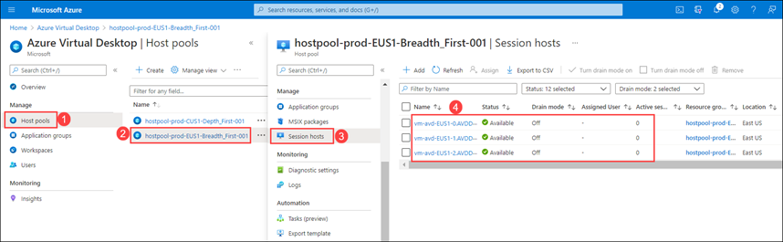
    
2.	Now go to the **Active Directory** and open **Users** given under _Manage_ pane on the left side. 
 
    
    
3.	We will pick users from same the region as of the host pool (i.e., EastUS) and connect to the sessions from both Browser and AVD Client.
    
4.	Open the below URL for Remote Desktop Web Client in a new browser tab on the JumpVM or your computer.
   
```
https://aka.ms/wvdarmweb
```
    
5.	Enter the credentials as given below:

  * **Username** – Enter the username **Ed.0629@AVDDemo.com** and click on **Next**.

    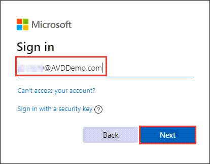
    
  * **Password** – Enter the password and click on **Sign in**.

    
    
    
> **Note:** If there's a dialog box with More information required, select **Skip** for now option.
>    
>    
>

7. The RemoteApps and the Workspace published to the logged in user will show up, click on **Excel** application to access it.

    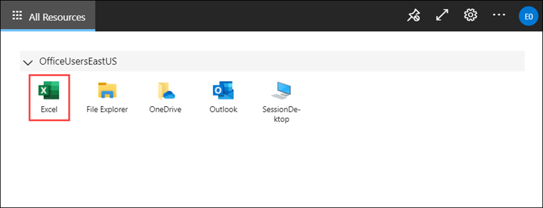

8. Select **Allow** on the prompt asking permission to Access local resources.
           
    
    
9. Enter the credentials for **Ed.0629@AVDDemo.com** and click on **Submit**.
 
    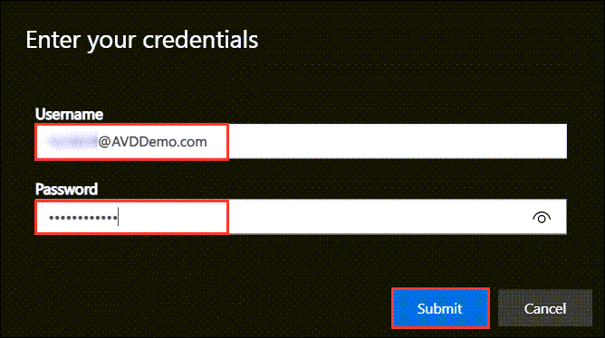
    
10.	Once signed in, the M365 App will open. The App will be auto activated and Auto logged in using SSO. 

    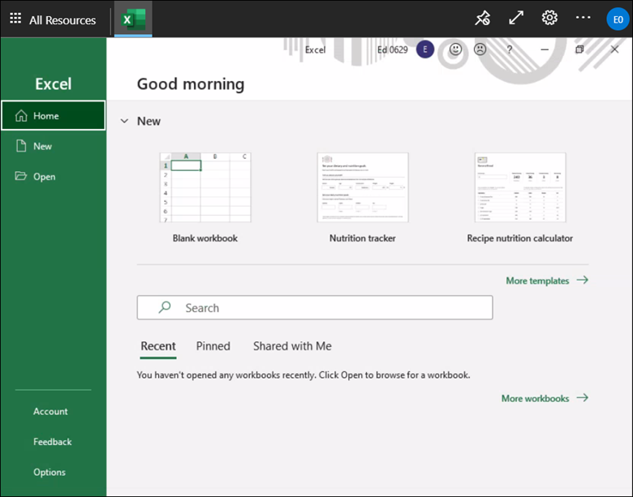
    
> **Talk through tip:** The first login does SSO in M365 App which also Activates M365 Apps based on the User License. On the above screen, if you notice the top right hand side corner; the user is already logged in using SSO.

11.	Launch **AVD Client** on your JumpVM. In AVD desktop client click on **Subscribe**. 

    
    
12.	Enter the credentials as given below:
  
  * **Username** – **Emily.6548@AVDDemo.com** and click on **Next**. 

    
    
  * **Password** – Enter the password and click on **Sign in**.

    
    
> **Note:** If there's a dialog box with More information required, select Skip for now option.
>    
>    
>

13.	The RemoteApps and the Workspace published to the logged in user will show up, double click on **File Explorer** application to access it.

    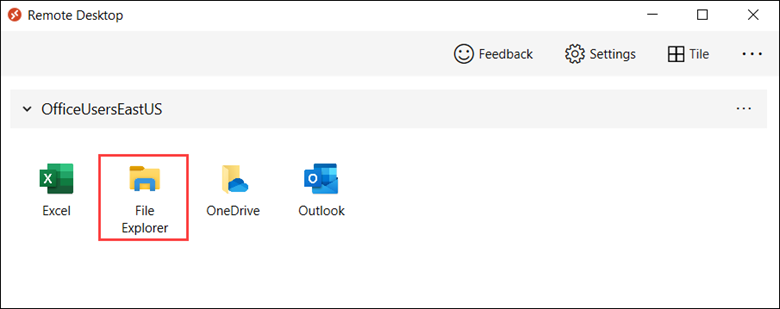

14.	Enter the credentials for **Emily@AVDDemo.com** and click on **OK**.
 
    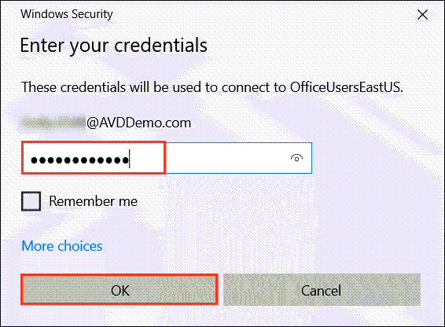

15.	On successful login, file explorer will launch as shown below.
 
    

16.	Navigate back to **Session hosts**  and view the **active sessions**. 

    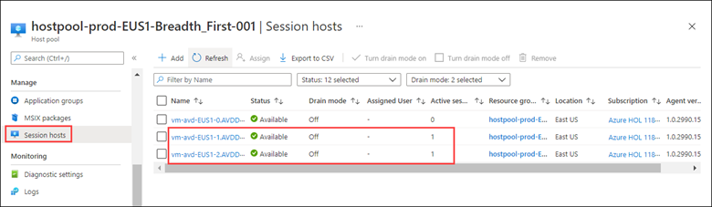

17.	This shows how users are distributed among different session hosts under **Breadth-first load balancing method**. The breadth-first method first queries session hosts that allow new connections. The method then selects a session host randomly from half the set of session hosts with the least number of sessions.

> **Note:** Click on **Refresh** if you don’t see latest results.
  


**B. Depth-first:** Depth-first load balancing distributes new user sessions to an available session host with the highest number of connections but has not reached its maximum session limit threshold.


1.	Navigate to **Azure Virtual Desktop** in the Azure portal. Open **Host pools** and select the host pool **hostpool-prod-CUS1-Depth_First-001** and then select **Session hosts**. In the sessions hosts section you will have three session hosts with zero active sessions.
 
    

3.	Now go to the **Active Directory** and open **Users** given under _Manage_ pane on the left side. 
 
    

4.	We will pick users from same the region as of the host pool (i.e., CentralUS) and connect to the sessions from both Browser and AVD Client.

5.	Open the below URL for Remote Desktop Web Client in a new browser tab on the JumpVM or your computer.

```
https://aka.ms/wvdarmweb
```

6.	Enter the credentials as given below:

  * **Username** – Enter the username **Callie.0629@AVDDemo.com** and click on **Next**.

    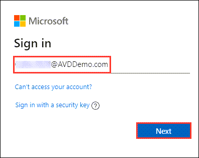

  * **Password** – Enter the password and click on **Sign in**.
  
    


> **Note:** If there's a dialog box with More information required, select Skip for now option.
>    
>    
>

7.	The RemoteApps and the Workspace published to the logged in user will show up, click on **PowerPoint** application to access it.
 
    

8.	Select **Allow** on the prompt asking permission to Access local resources.
 
    

9.	 Enter the credentials for **Callie.0629@AVDDemo.com** and click on **Submit**. 

    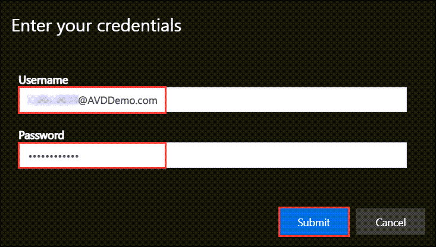

10.	Once signed in, the M365 App will open. The App will be auto activated and Auto logged in using SSO.

    

11.	Launch **AVD Client** on your JumpVM. In AVD desktop client click on **Subscribe**.
 
    

12.	Enter the credentials as given below:

  * **Username** – **Cody.0629@AVDDemo.com** and click on **Next**. 

    

  * **Password** – Enter the password and click on **Sign in**.
 
    


> **Note:** If there's a dialog box with More information required, select **Skip** for now option.
>
>   
>

13.	The RemoteApps and the Workspace published to the logged in user will show up, double click on **Session Desktop** application to access it.
 
    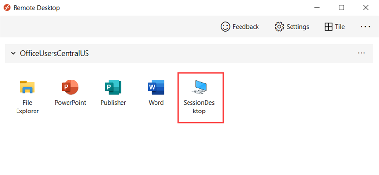

14.	Enter the credentials for **Cody.0629@AVDDemo.com** and click on **Submit**.
 
    

15.	Once signed in, the Full Desktop session will be presented to the user.
 
    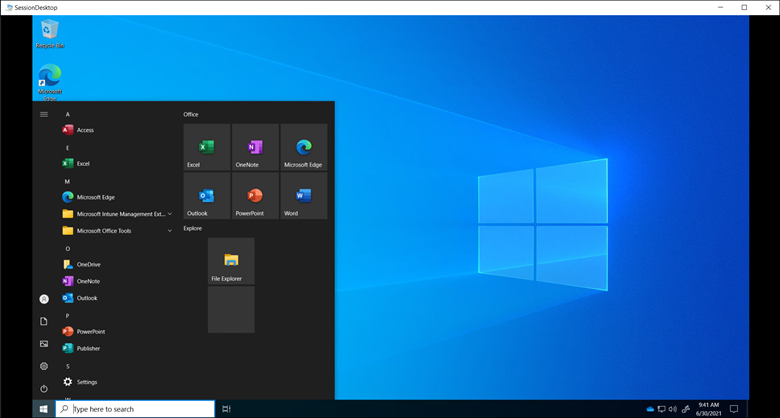

16.	Navigate back to **Session hosts** and view the active sessions. Here one of the session hosts, will have **2 Active sessions**. 

    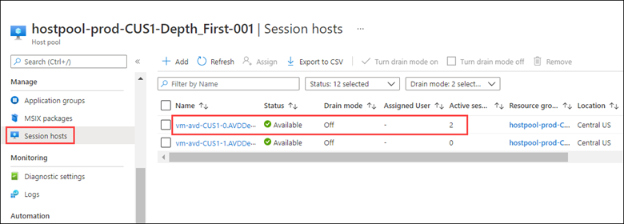

17.	The depth-first method first queries session hosts that allow new connections and haven't gone over their maximum session limit. The method then selects the session host with highest number of sessions. If there's a tie, the method selects the first session host in the query.
 
> **Note:** Click on **Refresh** if you don’t see latest results.

