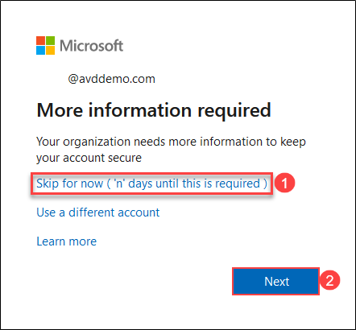
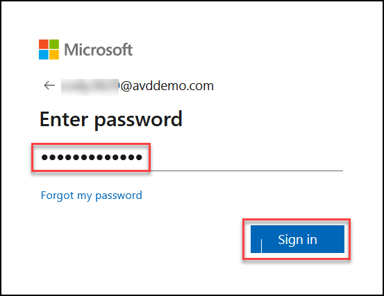
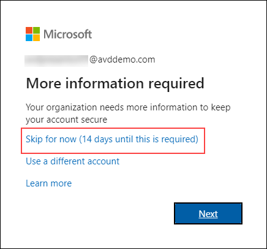

# **Getting Started**


1. Once you launch the lab, a virtual machine (JumpVM) on the left and lab guide on the right will get loaded in your browser. Use this virtual machine throughout the workshop to perform the lab.	

   	

2. You will have the **Environment Details** tab located next to the *Lab Guide* tab that will provide you details such as Username, Password for your user.

   	
   
3. Next to _Environment Details_ tab you will have **Resources** tab which will display the status of all the Virtual Machines available in your environment. 

   	

4. You will also have a set of **Actions** to control the Virtual Machines. The _Actions_ are as follows:
	
	* **Start:** Use this button to _Start_ a virtual machine.
	* **Restart:** Use this button to _Restart_ a virtual machine.
	* **Stop:** Use this button to _Deallocate_ a virtual machine.
   
   
   	
 
 5. At last, you will have **Help** tab in which we have listed known issues such as Unable to copy paste, Need credentials and much more. In case if you face any of these issues, you can troubleshoot it by following the instructions given there.
 

   	
   

### **Below are the files you'll need to get started with your session:**

**- ["Avddemo.com.vsdx" visio file can be downloaded from here](https://github.com/Eddevinc/AVD-STU-DEMO/raw/main/media/AVDDemo.com.vsdx)**

**- ["Azure Virtual Desktop.pptx" powerpoint file can be downloaded from here](https://github.com/Eddevinc/AVD-STU-DEMO/raw/main/media/Azure%20Virtual%20Desktop.pptx)**


# **Demo 1: AVD Login experience**


## **Task 1: Access the Published Applications using Browser**

In this demo, we will access the Desktop and RemoteApps assigned to an end user using a browser.


**Talk through tip:**
   **Mention to the audience:**
 - The user is signing in for the first time.  
 - All the user’s starting with **‘E’** in their first name belongs to **East US** region. 
 - All the user’s starting with **‘C’** in their first name belongs to **Central US** region.
 - All the users are licensed with M365 License
 - All the users have their password set to: <inject key="demo Admin Password" />

1. Open the below URL for Remote Desktop Web Client in a new browser tab on the JumpVM or your computer. 
      ```
      https://aka.ms/wvdarmweb
      ```

   >**Note:** If you are already logged in as the end user, jump to *step 3*.

2. Enter the credentials as below:

   - Enter the username as below and click **Next**.
       ```
       Emma.4896@AVDDemo.com
       ```   

   
   
   
   - Enter the password <inject key="demo Admin Password" /> and click **Sign in**.
   
   


   >**Note:** If there's a dialog box with *More information required*, select **Skip for now option**.
   >

>**Talk through tip:**
> Mention to the audience that the AVD environment is configured to enforce MFA, but for the demo purposes we have allowed the option to Skip the MFA setup for maximum of 14 days.


3. The RemoteApps and the Workspace published to the logged in user will show up, click on **Excel** application to access it.

   
   
4. Select **Allow** on the prompt asking permission to *Access local resources*.

   
   
5. Enter the credentials for **Emma.4896@AVDDemo.com** and click on **Submit**.

   

6. Once signed in, the M365 App will open. The App will be auto activated and Auto logged in using SSO.

   

>**Talk through tip:**
>The first login does SSO in M365 App which also Activates M365 Apps based on the User License.
>On the above screen, if you notice the top right hand side corner; the user is already logged in using SSO.


## **Task 2: Access the Published Applications using AVD Client**

In this demo, we will access the Desktop and RemoteApps assigned to an end user using a AVD Client.


1. Download and Install the AVD Client on your JumpVM; use below URL:

```
https://go.microsoft.com/fwlink/?linkid=2068602
```

2. Launch AVD Client on your JumpVM.

>**Note:** If you are already logged in as the end user, jump to *step 3*.

3. In AVD desktop client click on **Subscribe**.

   

4. Enter the credentials as below:

   - Enter the username as below and click **Next**.
       ```
       Emma.4896@AVDDemo.com
       ```
   

   
   
   
   - Enter the password <inject key="demo Admin Password" /> and click **Sign in**.
   

   


>**Note:** If there's a dialog box with *More information required*, select **Skip for now option**.
>
>

5. The RemoteApps and the Workspace published to the logged in user will show up, click on **Excel** application to access it.

   
   

6. Enter the credentials for *Emma.4896@AVDDemo.com* and click on **Submit**.

   

7. Upon successful Activation, the user can use the M365 Apps. 

   
   
## **Task 3: Access the Published Desktops using Browser**

In this demo, we will access the Desktop assigned to an end user using a browser.

1. Open the below URL for Remote Desktop Web Client in a new browser tab on the JumpVM or your computer. 
      ```
      https://aka.ms/wvdarmweb
      ```

>**Note:** If you are already logged in as the end user, jump to *step 3*.

2. Enter the credentials as below:

   - Enter the username as below and click **Next**.
       ```
       Camilia.4896@AVDDemo.com
       ```   

   
   
   
   - Enter the password <inject key="demo Admin Password" /> and click **Sign in**.
   
   

3. The RemoteApps and the Desktops published to the logged in user will show up, click on **SessionDesktop**.

   
   
4. Select **Allow** on the prompt asking permission to *Access local resources*.

   
   
5. Enter the credentials for **Camilia.4896@AVDDemo.com** and click on **Submit**.

   

6. Once signed in, the Full Desktop session will be presented to the user through the Browser.

   

## **Task 4: Access the Published Desktops using AVD Client**

In this demo, we will access the Desktop assigned to an end user using an AVD Client app.

1. Launch AVD Client on your JumpVM.

>**Note:** The AVD Client must be already logged in during the previous demo login; follow below steps to login using multiple accounts.

2. In AVD desktop client click on **Subscribe with URL**.

   

3. - Enter the below feed URL and click **Next**.
       ```
       https://rdweb.wvd.microsoft.com/api/arm/feeddiscovery
       ```   

   

4. - Enter the username as below and click **Next**.
       ```
       Eva.4896@AVDDemo.com
       ```   
   
   - Enter the password <inject key="demo Admin Password" /> and click **Sign in**.

5. The RemoteApps, along with the Session Desktops published to the logged in user will show up, click on **SessionDesktop**.

   
   

6. Enter the credentials for *Eva.4896@AVDDemo.com* and click on **OK**.

7. Once signed in, the Full Desktop session will be presented to the user. 

   

>**Talk through tip:**

>**RDP Ports**
   - Talk about how the client uses HTTPS (outbound) for all the Remote Desktop experience.
   - Explain the NO need of any INBOUND Network Ports.

   


8. In JumpVM launch Edge browser and navigate to Azure Portal using following URL.
     
     ```
     https://portal.azure.com
     ```
				
9. Sign in into the portal using the below credentials.

  - Username: AVDPresentor01@AVDDemo.com
  - Password: **<inject key="Demo Admin Password" />**

  

>**Note:** On the following prompt, click on **Skip for now**
>
>
>

   - Showcase how there are no Public IP Addresses assigned to the VMs running as Session Hosts in AVD.

   

   

   - Showcase the NSG's on the NICs of the AVD VMs which shows no Inbound ports for RDP or RDGW.

   

>**FSLogix Profiles**
   - The AVD User profiles are being stored in an Azure File Share.
   - We are using FSLogix Container settings to map the User Profiles to Azure Files.
   - East User's profiles are stored in East region and Central User's profiles are stored in Central region.
   - Profiles can be shown from Azure Files using Azure Portal

      - Open any one of the Azure Storage Account in Azure Portal and navigate to **Networking**
      - Add the Public IP to allow list so that the contents of the Azure Files can be accessed from the Portal.

      >**Note:** Azure Files are configured to allow access only from AVD Subnets; hence, to be able to access the Azure Files from Azure Portal, the Public IP that is being used to connect to the Azure Portal needs to be whitelisted.

      

      - Click on **File Shares** and then **upd**; here you will see the User Profiles created for our previous Demo User's Logins.

      
