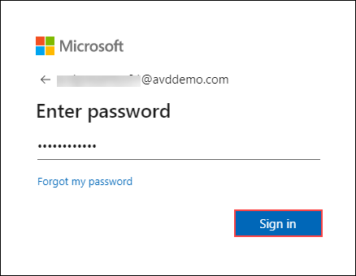
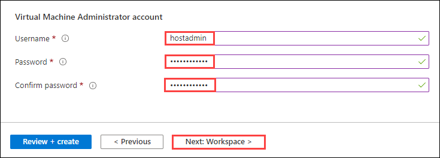

# **Demo 2: How to create Host Pools (Walkthrough only)**


## **Task 1: Adding Host Pools**

1. In JumpVM launch Edge browser and navigate to Azure Portal using following URL.     
```
https://portal.azure.com
```				
2. Sign in into the portal using the below credentials.
- Username:
```
AVDPresentor01@AVDDemo.com
```
- Password: **<inject key="Demo Admin Password" />**



>**Note:** If you are asked for MFA, Scan the below QR Code on your phone's Authenticator App and use the 6 digit code for MFA Authentication.
>

>

3. In Azure portal search for *Azure Virtual Desktop* and click on the search result.


					
4. Click on **Create a host pool**.


5. In this step, we will provide the details required to create a Host Pool. For your convenience, this step is divided into two sections as follows:


 **Project Details – (A)** Defines the Host Pool environment 

   - Subscription: *Choose the default subscription*.
   - Resource Group: *Select the Resource Group from the drop down*.
   - Host Pool Name: *Provide a name for the host pool*
   - Location: *Select the region in which we want to deploy the host pool*
   - Validation environmet: **No**
      
   >**Note:** Validation host pools let you monitor service updates before rolling them out to your production environment.
            
 **Host Pool Type – (B)** Defines the type of host pool. 

   - Host pool type: **Pooled** 
        
> **Note:** Host Pools are of 2 types: Pooled and Personal.  
>  - **Pooled**, where session hosts can accept connections from any user authorized to an app group within the host pool.
>  - **Personal**, where each session host is assigned to individual users.
     
   - Load Balancing Algorithm: **Breadth First**
   
> **Note:** Load Balancing Algorithm is of two types: *Breadth-first* and *Depth-first*. 
>  - **Breadth-first** load balancing allows you to evenly distribute user sessions across the session hosts in a host pool. 
>  - **Depth-first** load balancing allows you to saturate a session host with user sessions in a host pool. 

   - Max session Limit: **5**   
      
> **Note:** Max session Limit limits the simultaneous number of users on the same session host.
   
   - Then click on **Next:Virtual Machines**.
   
6. In the Virtual machines tab, select **Yes** against **Add virtual machines**. By doing this, we are stepping towards adding Virtual machines to the host pool. 


7. In this step, we will provide the details of the VMs to be created as session Hosts. For your convenience, this step is divided into three sections as follows:


  **A**. Session Host Specifications:     

   - Resource Group: *Select Resource Group from the drop down*.
   - Name prefix: _Provide an appropriate prefix for the Virtual Machine Name_
   - Virtual machine location: _Select the region in which we want to create our session hosts._
   - Availability options: _Select_ **No infrastructure redundancy required** _from the drop down_.
   - Image type: **Gallery**
   - Image: **Windows 10 Enterprise multi-session, version 20H2 (GEN 2)** *(choose from dropdown)*
   - Virtual machine size: **Standard D4s_v3**. *Click on **Change Size**, then select **D4s_v3** and click on **Select** as shown below*


   - Number of VMs: **2**
   - OS disk type: **Standard SSD**
   - Use managed disks: *Leave to default*
   - Boot Diagnostics: **Disable**

  **B**. Network and Security:


    
   Leave all values to default, except:
    
   - Virtual network: *Select the Virtual Network (choose from dropdown)*
   - Subnet: _Select the subnet for Virtual Machines (choose from dropdown)_
   - Specify Domain or Unit: **Yes**
   - Domain to join: **avddemo.com**
   - Organizational Unit path: **OU=EastUS,OU=AVD,OU=Computers,OU=AVDDemo,DC=AVDDemo,DC=com**

   
  **C**. Domain Administrator Account:
  

  
   - AD domain join UPN: **AVDPresentor01@AVDDemo.com**
   - Password: *Paste the password* **<inject key="Demo Admin Password" />**

  **D**. Virtual Machine Administrator Account:


  
   - Username: **hostadmin**
   - Password: *Paste the password* **<inject key="Demo Admin Password" />**
   - Confirm Password: *Paste the password* **<inject key="Demo Admin Password" />** *again.*
   - Click on **Next: Workspace** to proceed. 

8. In the Workspace section, we need to specify if we need to register the default application group to a workspace. 

   - Register desktop app group: *Choose* **Yes** 
   - To this workspace: *Click on* **Create new**


   
9. Once you click on **Create new**, a small window pops up, where you can specify the Workspace name you are going to create.  

   - Workspace name: OfficeEastUS 
   - Click on **OK**
     
 

10. Now click on **Review + create** on the bottom left corner. 

    
>**Note:** The last window helps us to verify if the parameters we filled are correct.

11. Click on **Cancel** to cancel the deployment.
