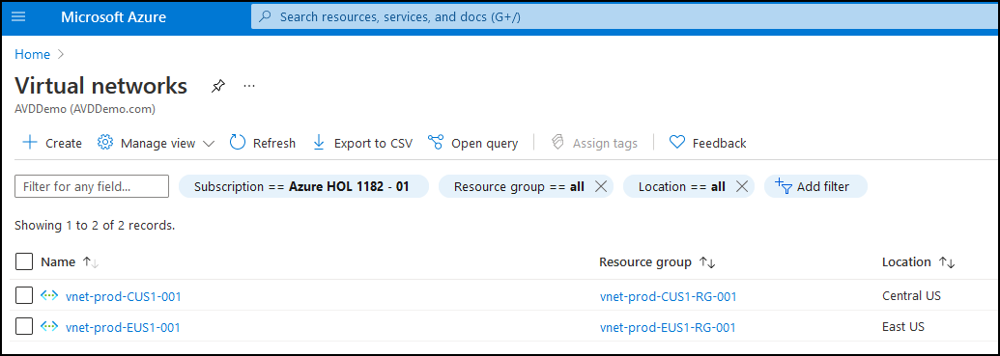

# **Demo 3: General walk through of Azure Resources (Demo)**

## **Networking and Domain Controllers overview**

In this demo, we will walk through the Azure networking and Domain Controller setup.

   - Use below credentials to access Azure Portal:
      - UserName:
         ```
         AVDPresentor01@AVDDemo.com
         ```
      - Password:  <inject key="demo Admin Password" />  

**Talk through**   
 - For this Demo, we have deployed two Domain Controllers; one in East US and one in Central US.
 - A VM Running Azure Connect application is Syncing Active Directory with Azure Active Directory.


- There are 2 vNets deployed in Azure, one in East and one in Central region.



- These vNets are connected to each other using vNet Peering.


- Both the vNets are configured to use the IP addresses of the Domain Controllers as DNS Servers.   
   


- Each vNet has its dedicated Subnet for AVD.

