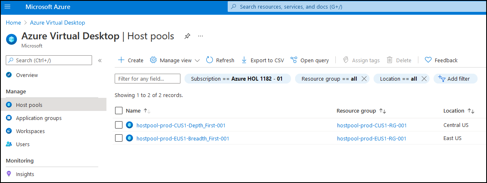
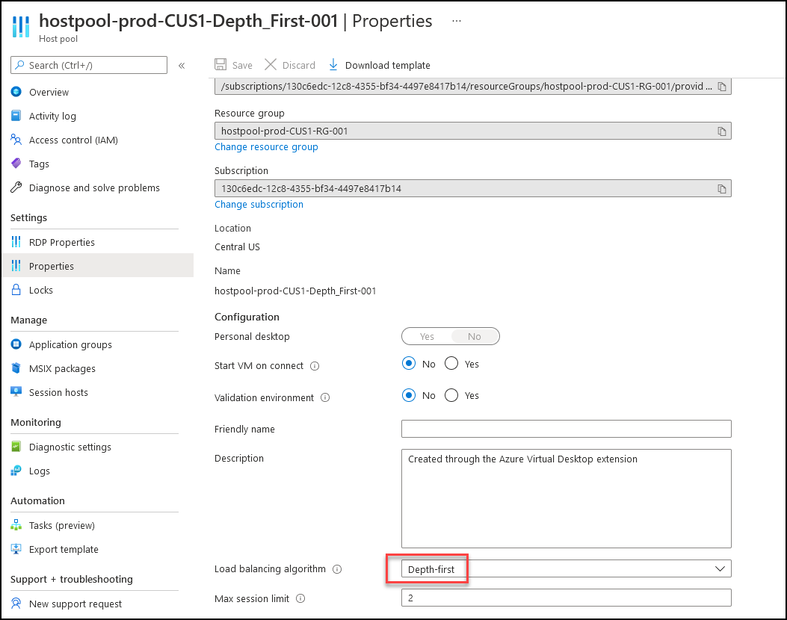
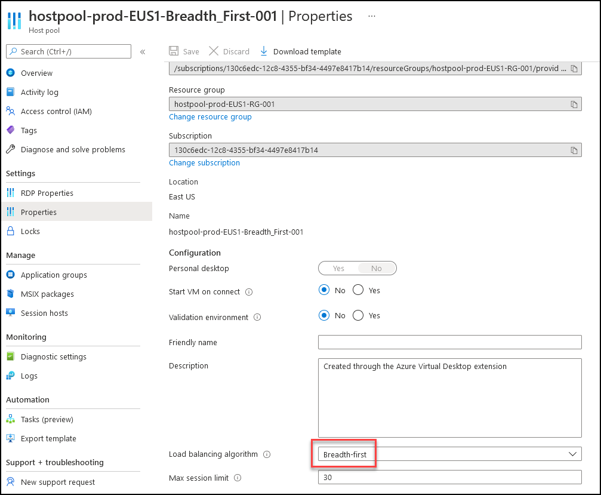
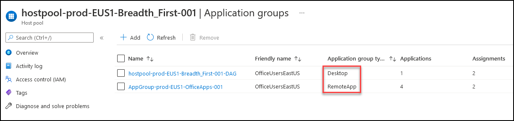
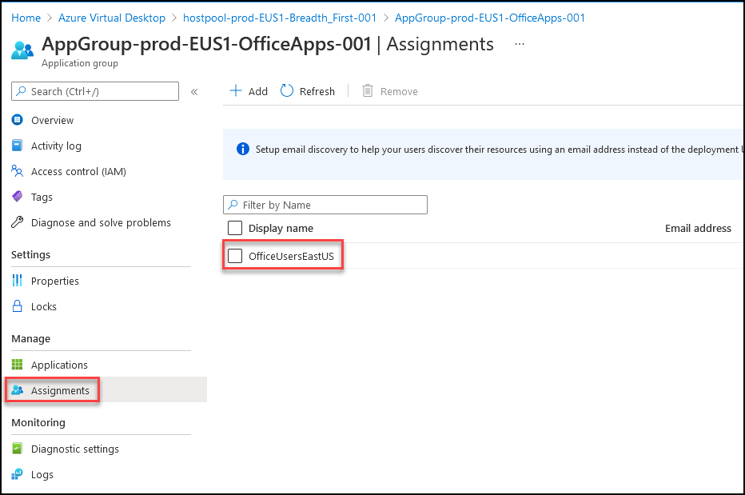
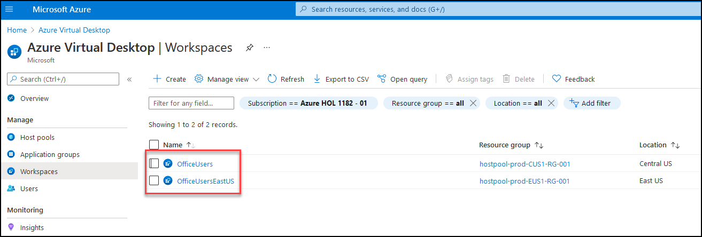
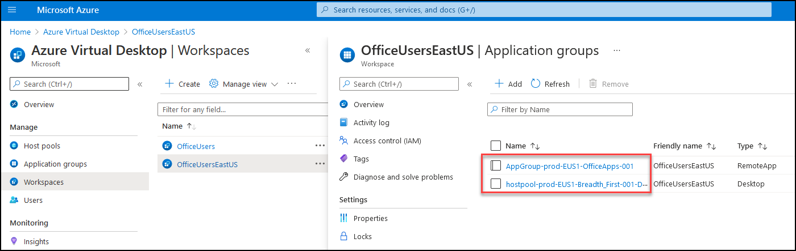

# **Demo 4: AVD Walk through Demo from Admin perspective**

## **AVD HostPool Setup**

In this demo, we will walk through the Azure Virtual Desktop setup.

**Talk through**

- For this Demo, we have deployed two AVD Hostpools; one in East US and one in Central US.

- **hostpool-prod-CUS1-Depth_First-001**, is configured as **Depth First** Load Balancing algorithm

- **hostpool-prod-EUS1-Breadth_First-001**, is configured as **Breadth First** Load Balancing algorithm

> Breadth-first load balancing distributes new user sessions across all available session hosts in the host pool. Depth-first load balancing distributes new user sessions to an available session host with the highest number of connections but has not reached its maximum session limit threshold.

- Both the Hostpools have 2 Application Groups each, one App group with Applications and one with Desktop access.

- **AppGroup-prod-EUS1-OfficeApps-001**, is assigned to a User Group **OfficeUsersEastUS**
- **AppGroup-prod-CUS1-OfficeApps-001**, is assigned to a User Group **OfficeUsersCentralUS**

## **AVD Workspaces**

> A workspace is a logical grouping of application groups in Azure Virtual Desktop. Each Azure Virtual Desktop application group must be associated with a workspace for users to see the remote apps and desktops published to them.

- In this Demo, we have created two Workspaces, **OfficeUsersCentralUS** and **OfficeUsersEastUS**

- Both the Workspaces logically combine the Appl;ication Groups.

