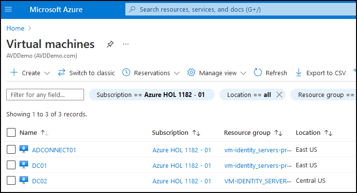
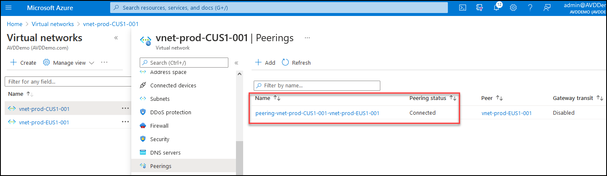
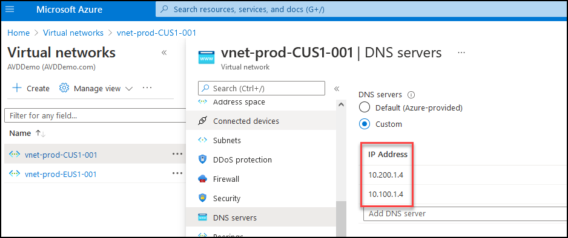

# **Demo 4: AVD Walk through Demo from Admin perspective**

## **AVD HostPool Setup**

In this demo, we will walk through the Azure Virtual Desktop setup.

**Talk through**   
 - For this Demo, we have deployed two Domain Controllers; one in East US and one in Central US.
 - A VM Running Azure Connect application is Syncing Active Directory with Azure Active Directory

- There are 2 vNets deployed in Azure, one in East and one in Central region.

- These vNets are connected to each other using vNet Peering.

- Both the vNets are configured to use the IP addresses of the Domain Controllers as DNS Servers.   
   

- Each vNet has its dedicated Subnet for AVD.

