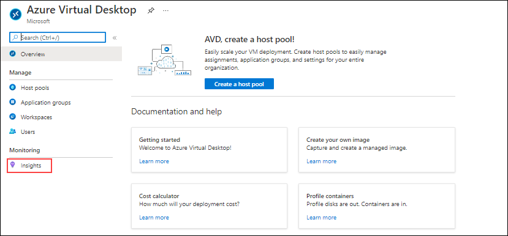
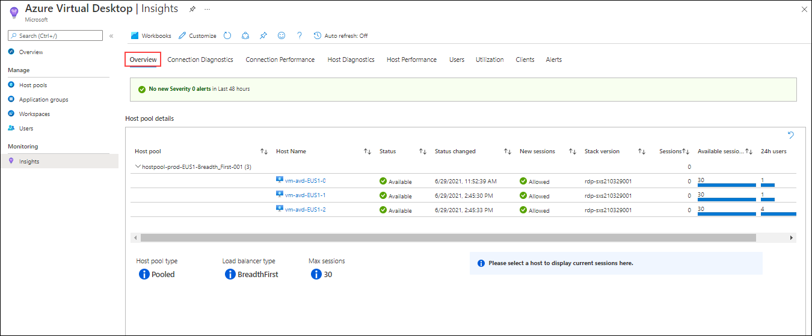
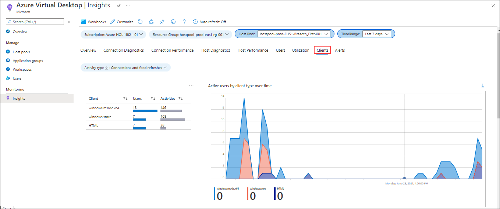
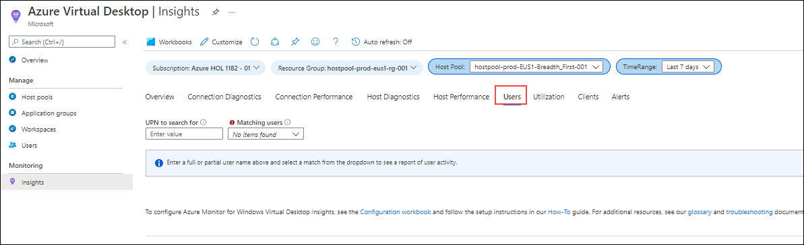
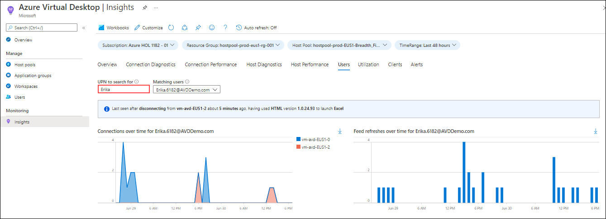
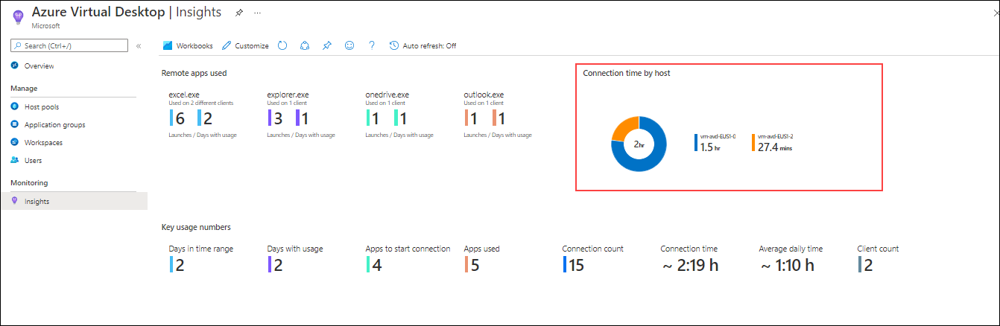

# **Demo 5: AVD Insights (Log Analytics)**

In This Demo we will be exploring Insigts on Azure Virtual Desktop

## **Task 1: Accessing Insights**

1. In Azure portal search for *Azure Virtual Desktop* and click on the search result.

  

2. In the left panel of Azure Virtual Desktop, Click on **Insights**.

  

>**Note:** It might take few seconds for Insights to fetch information.

3. Under **Overview** tab explore the information displayed regarding Host pool and session hosts.

  

4. Under **Clients** tab explore how we can monitor the different clients, users and their activities.

  

5. Navigate to **Users** tab.

  

6. Enter name of a user in **UPN to search for** then press enter, verify the selected user from **Matching users** dropdown menu.

  

7. Under user page we can also monitor *Connection time by host* of the user.

   
