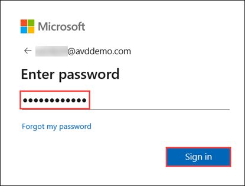
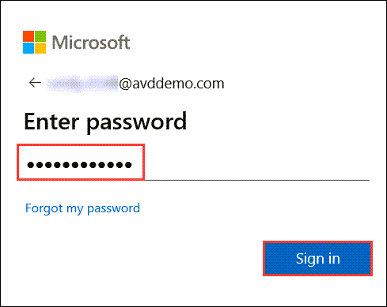
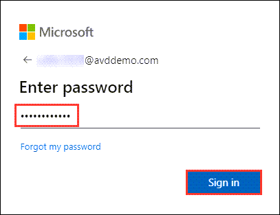
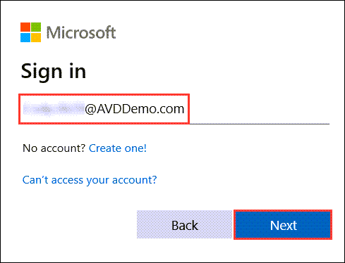
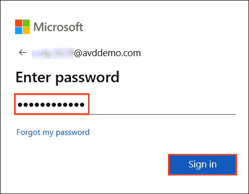

# **Demo 6: AVD Client session load balancing**

Azure Virtual Desktop supports two load-balancing methods. Each method determines which session host will host a user's session when they connect to a resource in a host pool. While configuring a host pool, we can select load balancing methods as per the needs.
The following load-balancing methods are available in Windows Virtual Desktop:

**A. Breadth-first:** Breadth-first load balancing distributes new user sessions across all available session hosts in the host pool.

**B. Depth-first:** Depth-first load balancing distributes new user sessions to an available session host with the highest number of connections but has not reached its maximum session limit threshold.


## **Task 1: Demonstrate 'Breadth-First' Load balancing capabilities in AVD**

1.	Navigate to **Azure Virtual Desktop** in the Azure portal. Open **Host pools** and select **hostpool-prod-EUS1-Breadth_First-001** and then select **Session hosts**. In the sessions hosts section you will have three session hosts with zero active sessions.


    
2.	Now go to the **Active Directory** and open **Users** given under _Manage_ pane on the left side. 


    
3.	We will pick users from same the region as of the host pool (i.e., EastUS) and connect to the sessions from both Browser and AVD Client.
    
4.	Open the below URL for Remote Desktop Web Client in a new browser tab on the JumpVM or your computer.
   
```
https://aka.ms/wvdarmweb
```
    
5.	Enter the credentials as given below:

  * **Username** – Enter the username **Eva.4896@AVDDemo.com** and click on **Next**.
    

    
  * **Password** – Enter the password and click on **Sign in**.


    
    
>**Note:** If you are asked for MFA, Scan the below QR Code on your phone's Authenticator App and use the 6 digit code for MFA Authentication.
>

>

7. The RemoteApps and the Workspace published to the logged in user will show up, click on **Excel** application to access it.


8. Select **Allow** on the prompt asking permission to Access local resources.
           

    
9. Enter the credentials for **Eva.4896@AVDDemo.com** and click on **Submit**.
 

    
10.	Once signed in, the M365 App will open. The App will be auto activated and Auto logged in using SSO. 


    
> **Talk through tip:** The first login does SSO in M365 App which also Activates M365 Apps based on the User License. On the above screen, if you notice the top right hand side corner; the user is already logged in using SSO.

11.	Launch **AVD Client** on your JumpVM. In AVD desktop client click on **Subscribe**. 


    
12.	Enter the credentials as given below:
  
  * **Username** – **Emma.4896@AVDDemo.com** and click on **Next**. 


    
  * **Password** – Enter the password and click on **Sign in**.


    
> **Note:** If there's a dialog box with More information required, select Skip for now option.
>    

>

13.	The RemoteApps and the Workspace published to the logged in user will show up, double click on **File Explorer** application to access it.


14.	Enter the credentials for **Emma.4896@AVDDemo.com** and click on **OK**.
 


15.	On successful login, file explorer will launch as shown below.
 


16.	Navigate back to **Session hosts**  and view the **active sessions**. 


17.	This shows how users are distributed among different session hosts under **Breadth-first load balancing method**. The breadth-first method first queries session hosts that allow new connections. The method then selects a session host randomly from half the set of session hosts with the least number of sessions.

> **Note:** Click on **Refresh** if you don’t see latest results.
  

## **Task 2: Demonstrate 'Depth-First' Load balancing capabilities in AVD**


1.	Navigate to **Azure Virtual Desktop** in the Azure portal. Open **Host pools** and select the host pool **hostpool-prod-CUS1-Depth_First-001** and then select **Session hosts**. In the sessions hosts section you will have three session hosts with zero active sessions.
 


3.	Now go to the **Active Directory** and open **Users** given under _Manage_ pane on the left side. 
 


4.	We will pick users from same the region as of the host pool (i.e., CentralUS) and connect to the sessions from both Browser and AVD Client.

5.	Open the below URL for Remote Desktop Web Client in a new browser tab on the JumpVM or your computer.

```
https://aka.ms/wvdarmweb
```

6.	Enter the credentials as given below:

  * **Username** – Enter the username **Cindy.4896@AVDDemo.com** and click on **Next**.


  * **Password** – Enter the password and click on **Sign in**.
  


>**Note:** If you are asked for MFA, Scan the below QR Code on your phone's Authenticator App and use the 6 digit code for MFA Authentication.
>

>

7.	The RemoteApps and the Workspace published to the logged in user will show up, click on **PowerPoint** application to access it.
 


8.	Select **Allow** on the prompt asking permission to Access local resources.
 


9. Enter the credentials for **Cindy.4896@AVDDemo.com** and click on **Submit**. 


10.	Once signed in, the M365 App will open. The App will be auto activated and Auto logged in using SSO.


11.	Launch **AVD Client** on your JumpVM. In AVD desktop client click on **Subscribe**.
 


12.	Enter the credentials as given below:

  * **Username** – **Camilia.4896@AVDDemo.com** and click on **Next**. 



  * **Password** – Enter the password and click on **Sign in**.
 



>**Note:** If you are asked for MFA, Scan the below QR Code on your phone's Authenticator App and use the 6 digit code for MFA Authentication.
>

>

13.	The RemoteApps and the Workspace published to the logged in user will show up, double click on **Session Desktop** application to access it.
 


14.	Enter the credentials for **Camilia.4896@AVDDemo.com** and click on **Submit**.
 


15.	Once signed in, the Full Desktop session will be presented to the user.
 


16.	Navigate back to **Session hosts** and view the active sessions. Here one of the session hosts, will have **2 Active sessions**. 


17.	The depth-first method first queries session hosts that allow new connections and haven't gone over their maximum session limit. The method then selects the session host with highest number of sessions. If there's a tie, the method selects the first session host in the query.
 
> **Note:** Click on **Refresh** if you don’t see latest results.
