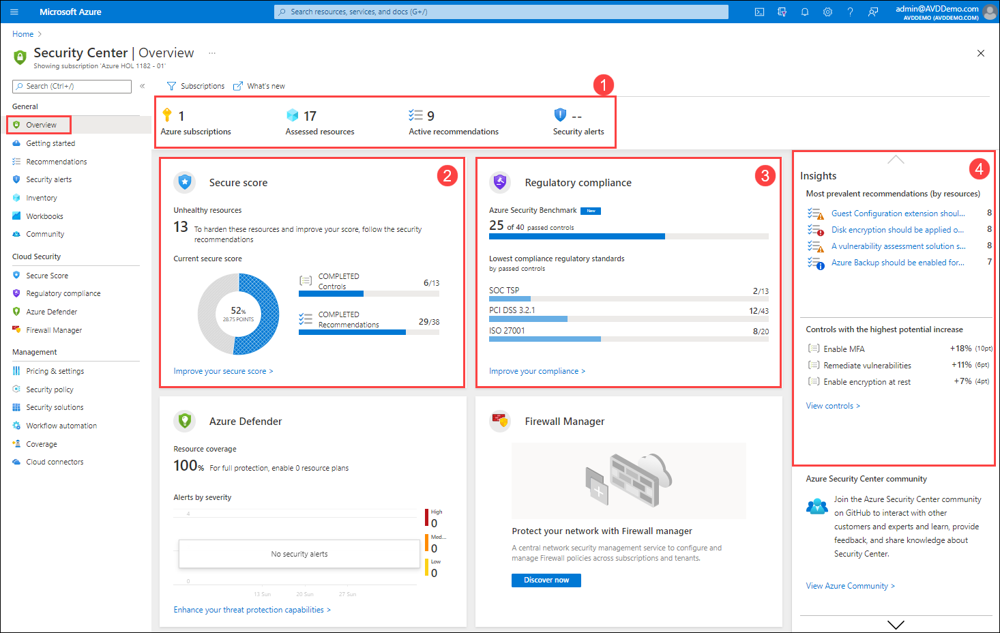
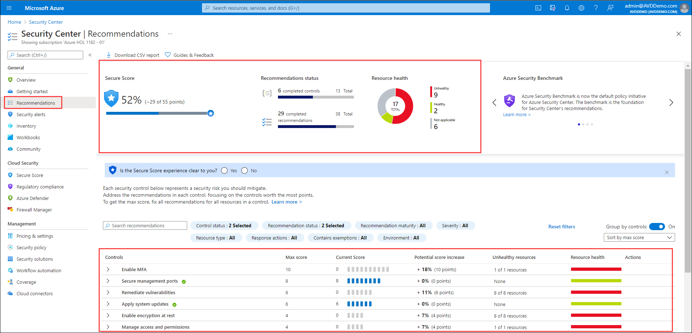
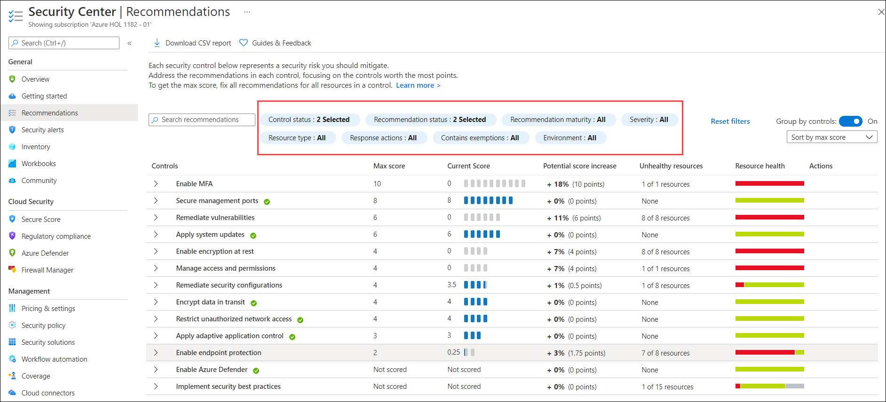
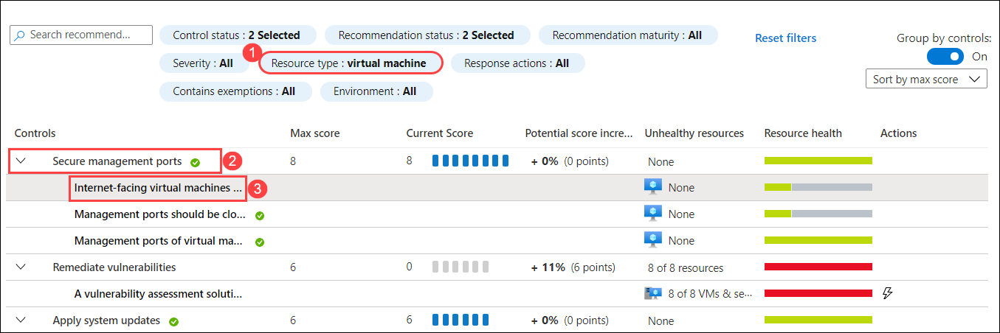
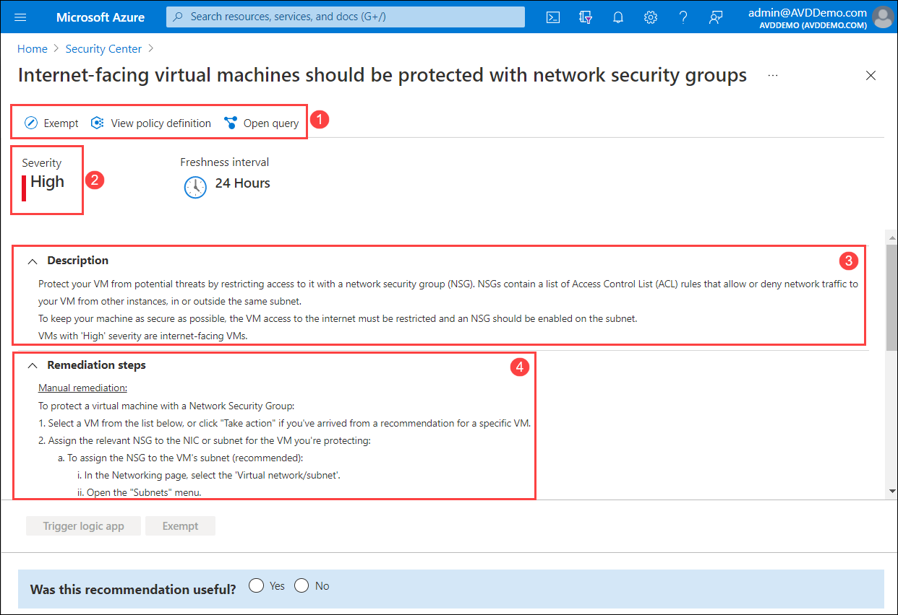
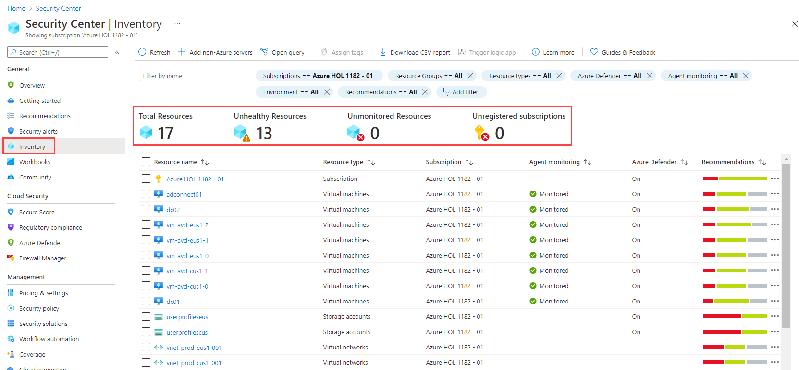
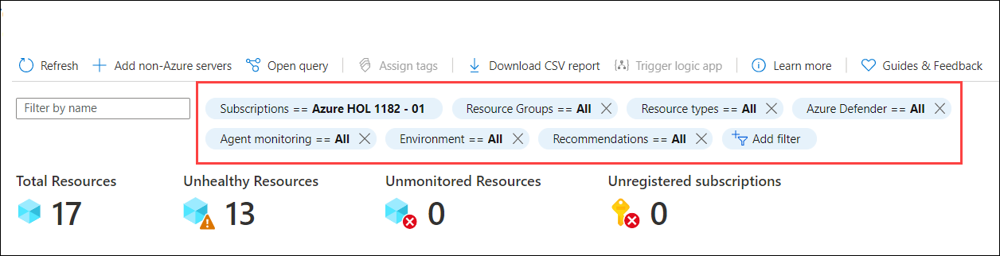
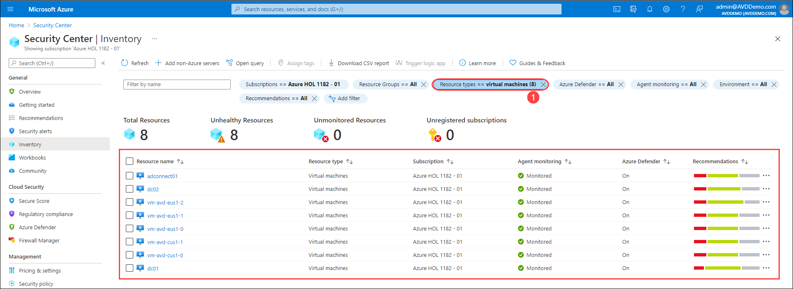
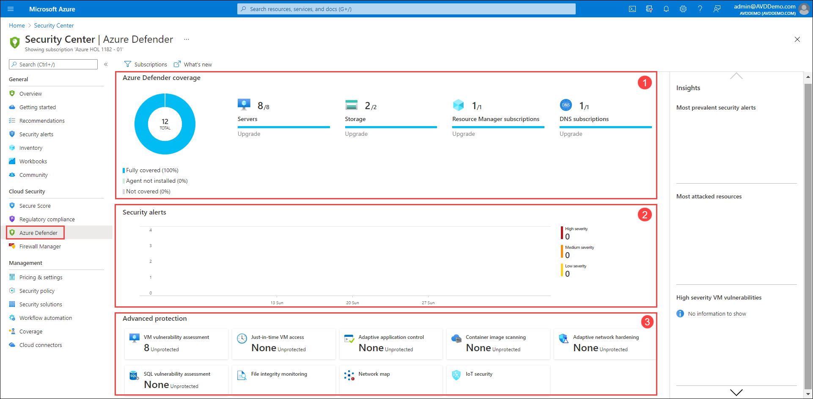

# **Demo 7: - Azure Security Center**

Azure Security Center is a single infrastructure security management system that improves the security posture of your data centres and provides sophisticated threat prevention 
across your hybrid workloads in the cloud, whether in Azure or not.

## Overview

**Security Center – Overview** provides a unified view into the security posture of your hybrid cloud workloads, enabling you to discover and assess the security of your workloads
and to identify and mitigate risk. 

1. Assess the security state of all your subscriptions, cloud resources and workloads that are running in Azure, on-premises, and in other clouds. 

2. Visualize your security state and improve your security posture by using Azure Secure Score recommendations. 

3. View your compliance against a wide variety of regulatory requirements or company security requirements by centrally managing security policies. 

4. Perform ongoing assessment and get rich, actionable insights and reports to simplify compliance.

## Recommendations 

Security Center periodically analyzes the security state of your Azure resources. When Security Center identifies potential security vulnerabilities, it creates recommendations. 
The recommendations guide you through the process of configuring the needed controls.

1. Open **Recommendations** from the Security Center's menu to examine the recommendations that apply to your environment. Security Center combines the recommendations into 
**security controls** and assigns a **secure score value** to each control to help you understand how important each recommendation is to your overall security posture.

2. To find recommendations specific to the resource type, severity, environment, or any other criteria, you can use the optional filters available above the list of recommendations.

3. Add a filter for **Resource types** and select **Virtual machines**. Expand the **Secure management ports** control and select a specific recommendation to view the recommendation details page.

4. The page mainly fouses on:

  * The toolbar at the top shows **Exempt** and **Deny** ( Prevent misconfigurations with Enforce/Deny recommendations), **View policy definition** and **Open query**.
  * **Severity indicator** to show the level of risk.
  * **Description** of the issue.
  * **Remediation steps** required to fix the security issue on the affected resources.

## Inventory 

The Inventory page of Azure Security Center provides a single view to the security posture of the resources you've connected to Security Center. Security Center periodically analyzes the security state of your Azure resources to identify potential security vulnerabilities. It then provides you with recommendations on how to remediate those vulnerabilities. When any resource has outstanding recommendations, they'll appear in the inventory.

1. Open **Inventory** from the Security Center's menu. The strip of values at the top of the inventory shows:

  * **Total resources** is basically total number of resources connected to the Security Center.
  * **Unhealthy resources** are the resources with active security recommendations.
  * **Unmonitored resources** are the resources that have agent monitoring issues.
  * **Unregistered subscriptions** could be any subscription in the selected scope that is not connected to Azure Security Center.

2. The multiple filters at the top of the page allow you to quickly narrow down the list of resources based on your needs. As soon as you've applied filters, the summary values are updated to relate to the query results.

3. Add a filter for **Resource types** and select **Virtual machines**. Once the filter is applied, you will have list of all virtual machines available in connected subscription showing **Agent Monitoring** and **Recommendations** for their respective virtual machines.

## Azure Defender

The Azure Defender dashboard provides visibility and control of the Cloud workload protection features for your environment. You can use Azure Defender to secure an entire Azure subscription, and the protections will be inherited by all resources within the subscription.

To enable all Security Center, including threat protection capabilities, you must enable Azure Defender on the subscription that contains the applicable workloads.

1. Open **Azure Defender** from the Security Center's menu.

  * **Azure Defender coverage**
  * **Security alerts:** When Azure Defender identifies a threat in any part of your environment, it generates a security alert. These alerts provide information on the affected resources and suggested remediation steps.
  * **Advanced protection:** Azure Defender makes specific suggestions based on advanced analytics about your resources. Security measures include protecting your VMs' management ports with just-in-time access and using adaptive application controls to create allow lists for which apps should and should not perform on your machines. To monitor and manage each of these protections, use the advanced protection tiles in the Azure Defender dashboard.

