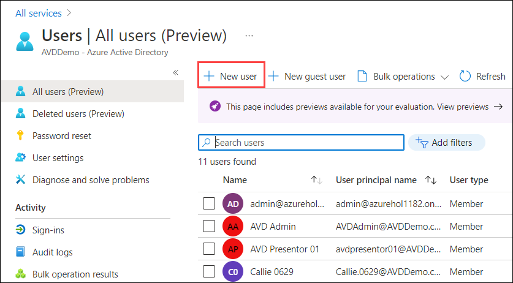

# **Demo 8: AVD Management with Intune**

## Microsoft Intune

Microsoft Intune is a cloud-based service that focuses on mobile device management (MDM) and mobile application management (MAM). You have control over how your company's gadgets, such as corporate devices, mobile phones, tablets, and laptops, are used. To restrict applications, you can also set specific security policies. 

Intune works with Azure Active Directory to manage who has access and what they can see. It also interacts with Azure Information Protection to keep the data secure.

## Microsoft Endpoint Manager

Microsoft Intune has moved to Microsoft Endpoint Manager. It serves to deliver a modern workplace and modern management in order to keep your data safe, both in the cloud and on-premises. It combines services including Microsoft Intune, Configuration Manager, Desktop Analytics, co-management, and Windows Autopilot and much more.

## AVD Management with Intune

Following are the technical configurations and criteria that must be completed before we can use WVD Intune.

* **Make sure the VMs are Hybrid AAD Join -** Azure AD Connect confirgutation should be in place to support Hybrid Azure AD Join scenarios.
* **MDM Group Policy for All WVD VMs -** This is a way to enroll Hybrid Azure AD joined Windows devices to Intune automatically. 

Now we will move to Microsoft Endpoint Manager.

1. Open a browser and sign in to the [Microsoft Endpoint Manager admin center](https://go.microsoft.com/fwlink/?linkid=2109431).

2. The Home page pane provides an overall visual snapshot of **Tenant status** and **Compliance status**, as well as other helpful related links. 

3. In the Microsoft Endpoint Manager, you will have all the services displayed in a pane on the left side of the browser. 

4. Select **Dashboard** from the navigation pane. It displays overall details about the devices and client apps in your Intune tenant.

Moving on to Favorites tab, we have divided the tab into multiple sections for your convenience.

**A. Devices**

1. Select **Devices** available under _Favorites_ tab. This section display the details about the enrolled devices in your Intune tenant.

2. On the **Overview** page, the strip on the top have several tabs that allow you to view a summary of the following statuses and alerts:

* **Enrollment status -** Here you will have details about the devices enrolled with Intune by platform and enrollment failures.

* **Enrollment alerts -** One can find more details about the devices those are unassigned by the platform.
 

* **Compliance status -** This section displays a list of devices that do not have a compliance policy. Also you can review the status of compliance in terms of device, policy, setting, threats, and protection.

* **Configuration status -** Here you can review the configuration status of device profiles as well as profile deployment.

* **Software update status -** In this section, one can have a look to visuals of the deployment status for all devices and for all users.

3. Now select **All devices** to display details about your devices that are enrolled with Intune tenant. The list of devices include details about Compliance, OS and OS version, by whom the device is managed and last check-in date.

4. Select **Compliance policies** available under _Policy_ tab, to view details regarding compliance for Intune-managed devices.

5. Intune compliance policies specify the rules and settings that users and devices must follow in order to be compliant. There are two parts to compliance policies in Intune:

* **Compliance policy settings –** Tenant-wide settings that act as a built-in compliance policy for each device.

* **Device compliance policy –** Configure and deploy platform-specific rules to groups of users or devices here. 

6. On the **Compliance policies** page, you will have a Device compliance policy created for Windows 10.

7. Select the policy to open it and then select **Properties** available under _Manage_ tab. Here you can review that what all is configured in this policy for a user. 

8. Select **Conditional access** available under _Policy_ tab, to display details about access policies.

9. Conditional Access refers to the ways through which you can control the devices and apps that are allowed to connect to your email and company resources. To create one select **+ New policy** and you will have multiple configurations one the new page as shown below.

10. Enter a name for your policy. Select **0 users and groups selected** given under _Assignments_, then select **Select users and groups** and check the **Users and groups** checkbox. 

11. In the search bar, search for the group of user on which you want to apply the policy. Select the group from the suggestions and at last select **OK**.

12. You have options such as **Cloud apps or actions** where you can control user access based on all or specific cloud apps or actions, and **Conditions** is where you can define when a policy should act on the basis of location, user risk and much more.

13. Next move to **Grant** under _Access controls_ and select **0 controls selected**. In this section you will have control over granting as well as blocking access to a user.
As shown below, you can specify _Multi-Factor Authentication_, _Device should be Intune Compliant_, _Device should be Hybrid Azure AD joined_ and much more. Once done, click on **Select** to save the configurations. 
 

14. At last, select **On** for _Enable policy_ to and select **Create**. 

**B. Apps**

1. Select **Apps** from the navigation pane in the left, to review the app status. 

2. You can see a summary on this page in respect to the following statuses:

* **Installation status -** You can examine the top installation failures by device as well as the apps having installation failures here.

* **App protection policy status -** Details regarding users who have been assigned to app protection policies as well as flagged users, can be found here.

3. Navigate to **All apps** and view the list of apps that have been added to Intune. Microsoft Intune can be used to manage the client apps used by your company's workers. This functionality is in addition to device management and data protection.

4. Intune supports a wide range of app types based on platform. Select **+ Add**, drop down the **App type** to view the list of available apps.

5. After you've added an app, you can assign it to user groups.

**C. Users**

1. From the navigation pane in the left, select **Users**. You will have a list of users that are included in Intune. 

2. You can add a new user to Intune by selecting **+ New user**. The rest of the process for creating a user is the same as it is on the Azure portal. 

3. Existing users from your on-premises Active Directory can also be synchronised. Once users have been added, they can enroll devices and access company resources . You can also give users additional permissions to access Intune.

**D. Groups**

1. Select **Groups** from the pane in left, to view the Azure Active Directory groups included in Intune. You can manage devices and users as an Intune administrator by using these groups.

2. You can add a new group as per the needs of your organization by selecting **+ New group**. The rest of the process for creating a user is the same as it is on the Azure portal. 

**E. Tenant Administration**

1. Now select **Tenant Administration** from the left pane. 

2. You will have **Tenant status** tab that provides **Tenant details, Connector status, and Service health dashboard.** In case if there is any issue with your tenant or Intune itself, you will find all the details available here.

