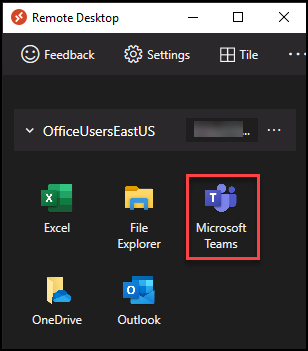
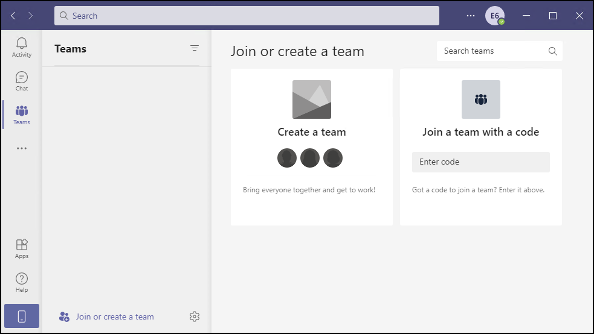

# **Demo 9: Microsoft Teams Azure Virtual Desktop Optimized experience**

Microsoft Teams on Azure Virtual Desktop supports chat and collaboration. With media optimizations, it also supports calling and meeting functionality.
With media optimization for Microsoft Teams, the Windows Desktop client handles audio and video locally for Teams calls and meetings. You can still use Microsoft Teams on Azure Virtual Desktop with other clients without optimized calling and meetings.

## Teams on VDI with calling and meetings

In addition to chat and collaboration, Teams on VDI with calling and meetings is available with supported virtualization provider platforms. Supported features are based on the WebRTC media stack and virtualization provider implementation. The following diagram provides an overview of the architecture.


## **Task 1a: Demonstrate Teams Audio Optimized experience**

>**Note:** Use the AVD Client installed on your Physical Laptop for this Demo.

1.	Launch the native (non remote app) Teams application from your Laptop and open **Settings** page, Navigate to the *Devices* tab.

2.	Demonstrate to the Audience and highlight the Physical *Audio devices* present on your Computer.


3.	Demonstrate to the Audience and highlight the Physical *Camera* present on your Computer.


4.	*Quit* Teams from your Computer by Right Clicking the Teams icon from System tray and click **Quit**


## **Task 1b: Access the Published Teams Application using AVD Client Installed on your OWN Laptop**

>**Note:** Use the AVD Client installed on your Physical Laptop for this Demo.

1. Launch AVD Client on your Laptop.

>**Note:** If you are already logged in as the end user, jump to *step 3*.

2. In AVD desktop client click on **Subscribe**.

   

3. Enter the credentials as below:

   - Enter the username as below and click **Next**.
       ```
       Erin.4896@AVDDemo.com
       ```   

      
   
   - Enter the password <inject key="demo Admin Password" /> and click **Sign in**.   

   

>**Note:** If you are asked for MFA, Scan the below QR Code on your phone's Authenticator App and use the 6 digit code for MFA Authentication.
>

>

4. The RemoteApps and the Workspace published to the logged in user will show up, click on **Microsoft Teams** application to access it.

   
   
5. Enter the credentials for *Erin.4896@AVDDemo.com* and click on **Submit**.

   

6. Upon successful login, **Microsoft Teams** RemoteApp will load. 

   
   

7. Verify media optimizations loaded

    - Select the *Settings and more* menu next to your user profile image, then select *About* > Select *Version*:

    

    - If media optimizations loaded, the banner will show you Azure Virtual Desktop Media optimized. If the banner shows you Azure Virtual Desktop Media not connected, quit the Teams app and try again.

    

    - Select the *Settings* menu next to your user profile image, then select *Devices*.

    - If media optimizations loaded, the audio devices and cameras available locally will be enumerated in the device menu.

        

    >**Note:** If the menu shows Remote audio, quit the Teams app and try again. If the devices still don't appear in the menu, check the Privacy settings on your local PC. Ensure the under Settings > Privacy > App permissions - Microphone the setting "Allow apps to access your microphone" is toggled On. Disconnect from the remote session, then reconnect and check the audio and video devices again. To join calls and meetings with video, you must also grant permission for apps to access your camera.

8. Do not close the Teams window for next Demo.


## **Task 2: Demonstrate AVD optimized meeting and screen sharing experience**

>**Note:** Use the AVD Client installed on your Physical Laptop for this Demo.

In this Demo; we will demonstrate the end user experience of joining meetings through Teams RemoteApp and how the end users can SHARE the screen of the physical Computer they are using.

1. On the remotely launched Teams App, navigate to *Calendar* > *Meet now* and click on *Start meeting*


2. On the *"Choose your audio and video settings"* page; verify the devices and click *Join now*


3. Bring up the *Share tray* and highlight that the screens that are available to be shared are from the Physical computer.


**Talk through tip:**
 - Despite of Teams being launched from an AVD Session host; we are able to share the actual Physical Screen of the Computer being used to access AVD.