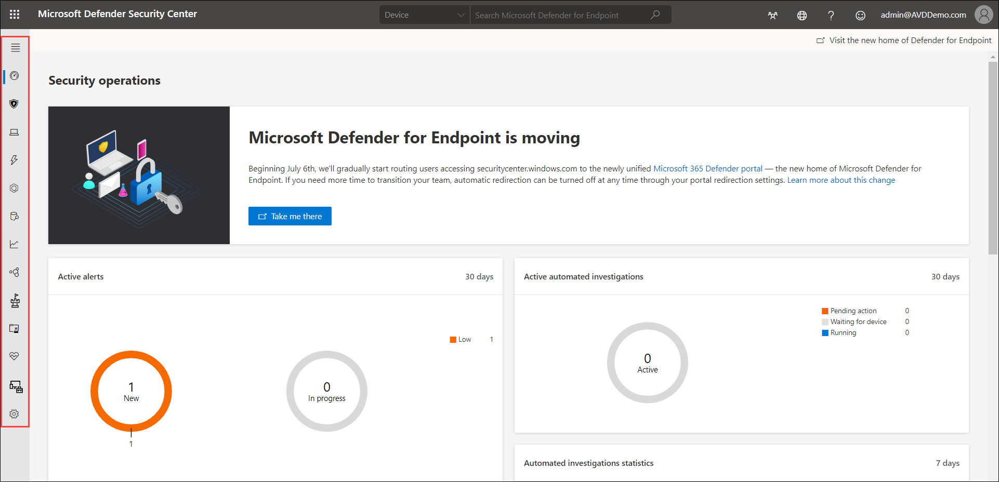
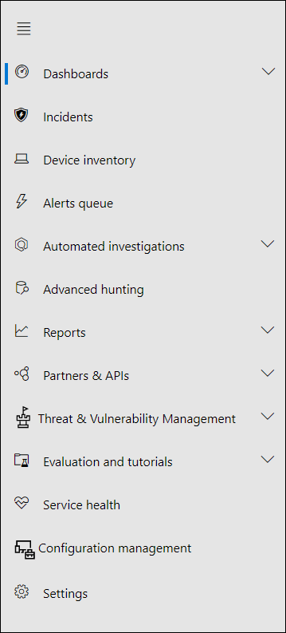

# Microsoft Defender ATP 

Microsoft Defender ATP is a very effective post-breach solution that enables automatic endpoint detection and response. It identifies and remediates malicious activities on your endpoints automatically. It analyses the scope and potential impact of each attack, reporting on the various threats to your organization's devices and allows you to rapidly and easily counteract and remove the threats using advanced tools and automation.

Because it is hosted in the cloud, Microsoft Defender ATM is agentless and does not require any setup or infrastructure. The method employs 'endpoint behavioral sensors,' which are installed in each device's operating system.

These Windows sensors are constantly gathering data and passing it to your organization's own Microsoft Defender cloud instance.
Microsoft Defender ATP then examines the behavior of the programs that run on your organization's machines to see whether anything seems to be a threat.

## Microsoft Defender Security Center 

1. Open a browser and sign in to the [Microsoft Defender Security Center](https://securitycenter.windows.com/dashboard).

2. On the homepage you will have Navigation pane (select the horizontal lines at the top left of the navigation pane to show or hide it). 

3. You can explore the portal by using the menu options given in each section.

4. Now you will have alook to each of the section provided in the navigation pane and they are as follows:

**Dashboards:**	In the Dashboard, you can Access the active automated investigations, active alerts, automated investigations statistics, devices at risk, users at risk, devices with sensor issues, service health, detection sources, and daily devices reporting dashboards.

**Incidents:**	View alerts that have been combined as incidents in this section. You can also view the device which has caused the incident.

**Devices Inventory:**	The Device Inventoy presents a list of devices that have been added to Defender for Endpoint, as well as basic information about them, as well as their exposure and risk levels.

**Alerts queue:**	Here you can view alerts received by your workplace's devices.

**Automated investigations:**	Displays automated investigations that have been conducted in the network, triggering alert, the status of each investigation and other details such as when the investigation started and the duration of the investigation.

**Advanced hunting:**	Advanced hunting allows you to proactively hunt and investigate across your organization using a powerful search and query tool.

**Reports:**	View graphs detailing the following:
1. Threat protection

2. Device health and compliance

3. Web protection

4. Vulnerable devices

**Partners & APIs:**	Here you can see the supported partner connections, which improve the platform's detection, investigation, and threat intelligence capabilities. Also, you can view connected applications, the API explorer, an API usage overview, and data export settings.

**Threat & Vulnerability management:**	View your Microsoft Secure Score for Devices, exposure score, exposed devices, vulnerable software, and take action on top security recommendations.

**Evaluation and tutorials:**	Manage test devices, attack simulations, and reports. Learn and experience the Defender for Endpoint capabilities through a guided walk-through in a trial environment.

**Service health:**	Provides information on the current status of the Defender for Endpoint service. You'll be able to verify that the service health is healthy or if there are current issues.

**Configuration management:**	Displays on-boarded devices, your organizations' security baseline, predictive analysis, web protection coverage, and allows you to perform attack surface management on your devices.

**Settings:**	Shows the settings you selected during onboarding and lets you update your industry preferences and retention policy period. You can also set other configuration settings such as permissions, APIs, rules, device management, IT service management, and network assessments.

