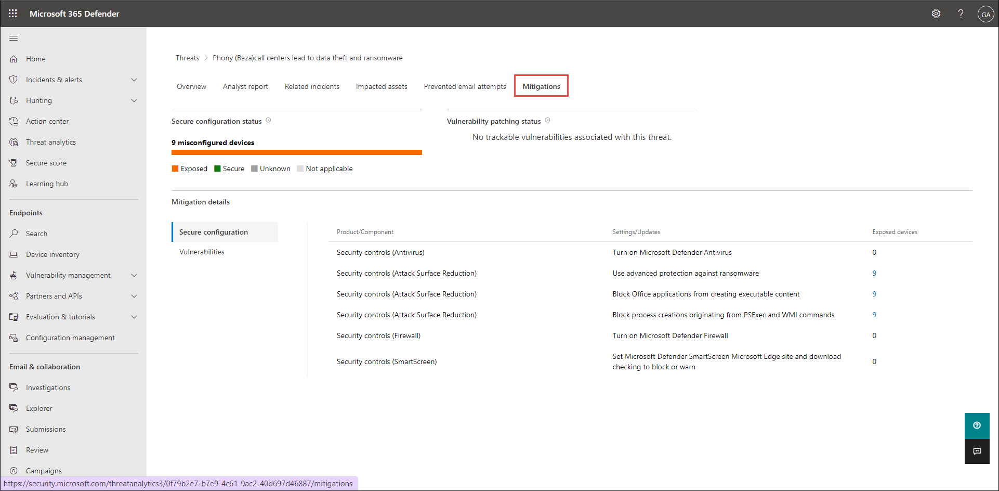

# **Demo 10: Microsoft Defender ATP** 

Microsoft 365 Defender is an integrated, cross-domain threat-detection and response solution. It can aid in the prevention, detection, investigation, and remediation of sophisticated threats across Microsoft 365. It also acts in the prevention of attacks by reducing your attack surface and eliminating persistent threats. Then, it automates threat resolution across domains by combining threat data for a quick and thorough response.

It also frees up defenders' time to focus on proactive hunting and other critical tasks such as developing custom tools and applying proprietary tactics and knowledge to better defend the organization.

Microsoft 365 Defender combines functionality from existing Microsoft security portals such as Microsoft Defender Security Center and Office 365 Security & Compliance Center. The security centre prioritises easy access to information, simpler layouts, and combining related information for easier use.

## Microsoft Defender Security Center 

1. Open a browser and sign in to the [Microsoft 365 Defender](https://security.microsoft.com/homepage).

2. On the homepage you will have **Navigation pane** (select the horizontal lines at the top left of the navigation pane to show or hide it). Here you can explore the portal by using the menu options given in each section

3. The homepage of the portal gives an overview of multiple items such as:

* **Microsoft Secure Score** is a metric that measures an organization's security posture, with a higher number of opportunities to improve it.
* **Users at risk** is basically a represntation of the information specific to the security risk of a user account.
* **Threat analytics** allows you to continuously assess and control your risk of being exposed to threats. Use the charts to quickly determine whether or not a device has mitigations.
* **Device compliance** chart helps you to review Intune device compliance status and troubleshoot compliance-related issues in your organization.
* **Active incidents** shows the latest incidents and alerts received by your workplace's devices. 
* **Devices with active malware** helps you to review Intune-managed devices with active, unresolved malware.
* **Discovered devices** 
* **Microsoft 365 Defender Feed** is a section where you can find what new with Microsoft 365 Defender.

4. Now you will have alook to each of the section provided in the navigation pane and they are as follows:

* **Incidents & alerts:** Microsoft 365 Defender reduces confusion and clutter by combining alerts from across Microsoft 365 and categorizing them as **Incidents**, all on a single dashboard. They help to prioritize work, reduce signal fatigue, and provide more comprehensive views of threats. You can explore different tabs such as:

  * **Summary:** The Summary tab provides detailed information about the attackers' techniques, the scope of impacted entities, and the evidence uncovered. The entire attack can be seen in context with a quick glance. Other tabs provide more specific information.

      

   * **Alerts:** The Alerts tab displays the alerts associated with this incident. It enables you to fully understand the remediation methods implemented by Microsoft 365 Defender in the face of a threat.

      

   * **Devices:** On the Devices tab, you can see a list of the devices affected by this incident. As with any entity in an incident, you can select a device to get more detail.

      

Likewise, you can also see a list of impacted **Users**, **Mailboxes**, all automated **Investigations** that Microsoft 365 Defender performed, including their statuses and service sources, and all the **Evidence** that it reviewed during those investigations. 

* **Advanced hunting:** By taking advantage of the extensive automation in Microsoft 365 Defender, your security team now has the time and resources to proactively hunt across the wealth of data it provides. Leverage the team's organizational experience and knowledge to find sophisticated breaches and create custom tools and response workflows--by using advanced hunting.

  Get started by selecting one of the example queries from the list or create your own queries using the schema that advanced hunting provides. In many cases, writing your own query is simply not necessary. You'll find a tremendous number of useful queries shared by the community, suggested by Microsoft 365 Defender, and shared by your team.
  
  

* **Action Center:** To investigate incidents, Microsoft 365 Defender uses extensive cross-domain automation and artificial intelligence. In many cases, it can stop threats without the assistance of the security team. However, some remediations may require approval, which you can do in the Action Center.

* **Threat analytics:** Threat analytics is a built-in threat intelligence solution that helps security teams face emerging threats as efficiently as possible. You can identify and react to emerging threats by comparing your security posture to them, all in one place.

  * In here you can see a ribbon in the top showing activities such as **Ransomware, Phishing and Vulnerability**.
  * You will a information about latest threats, those which have high-impact, and an over all summary.
  * Now, select a threat to open the report.

      

  * You will immediately see a short summary of the threat and an overview of your security posture related specifically to it.

      

  * **Analyst Report:** It contains the detailed threat intelligence. That includes a deep-dive analysis that usually features a kill-chain diagram, recommended mitigations, detection details, oftentimes advanced hunting queries that you can use to expand your detection coverage and MITRE techniques, 

      

  * **Related incidents:** It lists incidents related to this specific threat. You can select an incident to open its details in the side pane which will have details such as status, classification, entities impacted by it, and so on.

  * **Impacted Assets:** It lists the devices and mailboxes impacted by the threat in your organization. That is, they have alerts related to the threat.

  * **Prevented email attempts:** Here you can view lists of impacted devices or impacted mailboxes. It lists each email related to the threat, including the delivery action and location. 
  
  * **Mitigation:** This tab lists mitigations and their statuses. It provides options for investigating and remediating weaknesses by using threat and vulnerability management.

      

* **Secure Score:** The Secure Score is a security metric that provides Microsoft 365 users with information about their current level of protection. The score is calculated by analyzing your regular activity and security settings in Microsoft 365, demonstrating how well your organization is aligned with Microsoft's best security practices and providing recommended steps to improve your security position in Microsoft 365. 

  * In **Overview** you'll see the score is percentage based, and it breaks down across the various security categories such as identity, devices and apps. 

      

  * So things like identity, devices and apps, for each one, it shows the activity history, and how you're organization stacks up against others.

      

  * You can also get tailored recommendation for controls that show you what to implement based on what you have deployed, what type of devices you've enrolled in your organization, and even which versions of Microsoft 365, Windows or Office you have.

      
      
  * Under **Improvement actions** tab, you'll have some of the really heavy hitters with high impact are things like multi-factor authentication, sharing controls, and remote work assist.

      

  * In **History** tab, you can actually track your progress over time, and all the activities along with the points for each. This is helpful for communicating progress to stakeholders about security.

      

  * At last in **Metrics & trends**, you'll see even more insights, and you can see things like your score zones, a comparison trend over time of your score, and how it compares to other organizations like yours and maybe in a similar industry. You can also see any regressions due to configuration, user, or device changes. 
 
  You can see your score changes since your last discussion or check in. And any risk acceptance trends for the improvement actions, where you've opted out or said that you want to accept the risk of not implementing. 

Now moving to **Endpoints** section, you will have tabs as listed below:

* **Devices Inventory:** The Device Inventoy presents a list of devices that have been added to Defender for Endpoint, as well as basic information about them, as well as their exposure and risk levels.

* **Vulnerability management:** Select the drop down and you will have the following tabs available for you:

  * **Dashboard**	This section provides a high-level overview of the organization's exposure score, Microsoft Secure Score for Devices, device exposure distribution, top security recommendations, top vulnerable software, top remediation activities, and top exposed device data.

      

  * **Security recommendations**	See the list of security recommendations and related threat information. When you select an item from the list, a flyout panel opens with vulnerability details, a link to open the software page, and remediation and exception options. You can also open a ticket in Intune if your devices are joined through Azure Active Directory and you've enabled your Intune connections in Defender for Endpoint.

      

  * **Remediation**	You can view the remediation activities you've created as well as the recommended exceptions.
      
  * **Software inventory**	View the list of vulnerable software in your organization, along with weakness and threat information.

      

  * **Weaknesses**	In this section, you have a list of common vulnerabilities and exposures (CVEs) in your organization.

      

  * **Event timeline**	View events that may impact your organization's risk.

      

* **Partners & APIs:** Here you can see the supported partner connections, which improve the platform's detection, investigation, and threat intelligence capabilities under **Partner applications**. 
  
  * You can view connected applications, the API explorer is used to test Microsoft Defender for Endpoint capabilities, here you can use the sample queries to get started.
  * View supported partner connections under Professional services tab. You can enhance the detection, investigation, and threat intelligence capabilities of the platform with the help of partner connections.

      

* **Evaluation and tutorials:** Manage test devices, attack simulations, and reports. Learn and experience the Defender for Endpoint capabilities through a guided walk-through in a trial environment.

* **Configuration management:** Displays on-boarded devices, your organizations' security baseline, predictive analysis, web protection coverage, and allows you to perform attack surface management on your devices.

* **Email & collaboration:** 

  * **Explorer:**
  * **Threat Tracker:**
  * **Attack simulation tracking:** To run realistic attack scenarios in your organisation, you can use Attack simulation training in the Microsoft 365 Defender portal. These simulated attacks can assist you in identifying and locating vulnerable users before a real attack has an impact on your bottom line.

  * **Policies & rules:** You can use this section to set up policies to manage devices, protect against threats, and receive alerts about various activities in your organization.

   * **Threat policy:** You can create policies that will help in protecting your organization from malicious impersonation-based phishing attacks and other types of phishing attacks.
 

   * Likewise, you have **Alert policy** to track user and admin activities, malware threats, or data loss incidents in your organization, **Manage advanced alerts** to set up policies that can alert you to suspicious and anomalous activity in Microsoft 365.  

* **Reports:** View data on security trends and monitor the security status of your identities, data, devices, apps, and infrastructure.

* **Audit:** Auditing offers an integrated solution to assist organisations in responding effectively to security events, forensic investigations, internal investigations, and compliance obligations. This feature provides insight into the activities carried out across your Microsoft 365 organisation.

  * Audit provides with you with the ability to log and search for audited activities and power your forensic, IT, compliance, and legal investigations. Use the Audit log search tool in the Microsoft 365 compliance center to search for audit records. You can search for specific activities, for activities performed by specific users, and activities that occurred with a date range. 

* **Health:** Admins are users added to the admin role, and can view any data and complete any task in the Microsoft 365 security center. You should have few admins, and grant users only the permissions needed to perform their duties when you assign access.

* **Permissions & roles:** 
  
  
* **Settings:** 

   * **Endpoint:**	Shows the settings you selected during onboarding and lets you update your industry preferences and retention policy period. You can also set other configuration settings such as permissions, APIs, rules, device management, IT service management, and network assessments.

## Onboard devices in Microsoft Defender ATP using Microsoft Intune

You can onboard any version of Windows that Microsoft Defender ATP supports. However, you must have a Windows 10 Enterprise E5 or Microsoft 365 Enterprise E5 license.

Microsoft Defender ATP has some additional requirements that Windows 10 devices need to meet:

* First, Microsoft Defender ATP requires the Diag Track service to be running in order to report cyber data. That’s the default Windows configuration, so just double-check that you haven’t turned it off.

* Microsoft Defender ATP requires an Internet connection. Its sensor can use about 5 megabytes each day to talk to the cloud service, plus additional bandwidth for files and investigation packages(which are sent only if you request them).

* Last, even if Windows Defender Antivirus isn’t the primary antimalware product, Microsoft Defender ATP relies on its passive mode to scan and provide information about files. 

Connecting Microsoft Defender ATP and Microsoft Intune enables scenarios like conditional access based on threat levels, and it also streamlines the onboarding process, since you don’t have to manually perfrom it. You turn that connection on in both places.

1. First, enable the Microsoft Intune connection in Microsoft Defender Security Center settings.

2. Open [Microsoft Defender Security Center](https://securitycenter.windows.com/dashboard) in a browser. From the navigation pane in the left select **Settings**, then select **Advanced features** and scroll down to **Microsoft Intune connection**.

3. Toggle the **Microsoft Intune connection** option to enable it

4. Second, turn on the Microsoft Defender ATP connection in Microsoft Intune. That control is in Device compliance, Microsoft Defender ATP. That control is in Device compliance, Microsoft Defender ATP

5. Connect to [Microsoft Endpoint Manager admin center](https://go.microsoft.com/fwlink/?linkid=2109431) and create a device configuration profile for Windows 10 or later that’s based on the Microsoft Defender ATP profile type. 

6. From the navigation pane in the left select **Devices**, then select **Configuration profiles**

7. You can add a new policy by selecting **+ Create Policy** and assign the profile to the devices you want to target.

8. Select the following options from drop downs:

* **Platform:** Windows 0 and later
* **Profile type** Templates
* **Template Name:** Microsoft Defender for Endpoint (Windows 10 Desktop) 
* Select **Create**

9. On the **Basics** tab, enter the following values for:

* **Name:** Microsoft Defender for Endpoint (Windows 10 Desktop)
* **Descritpion:** Microsoft Defender for Endpoint (Windows 10 Desktop) 
* Select **Next**

10. On the **Configuration settings** tab, select **Enable** for Expedite telemetry reporting frequency and select **Next**.

11. On the **Assignments** tab, fom Included groups secion select **+ Add all users** and **+ Add all devices** and select **Next**.

12. On the **Applicability Rules** tab, leave all on default and select **Next**.

13. On **Summary** page, review all the configurations and select **Create** to create the profiles.
 

14. Once you’ve deployed the device configuration profile, monitoring uptake is easy. The Microsoft Defender ATP compliance chart indicates how many devices have the agent and how many do not. This chart is in Device compliance, under Microsoft Defender ATP.

## Microsoft 365 Defender - Attack Simulation Training

You can use Attack simulation training in the Microsoft 365 Defender portal to run realistic attack scenarios in your organization. These simulated attacks can assist you in identifying and locating vulnerable users before a real-world attack has an impact on your bottom line. More information can be found in this article.

You should have permissions in the Microsoft 365 Defender portal or in Azure Active Directory before you can perfrom attack simulation. Specifically, you need to be a member of Organization Management, Security Administrator, or one of the following roles:

* Attack Simulator Administrators: Create and managed all aspects of attack simulation campaigns.
* Attack Simulator Payload Authors: Create attack payloads that an admin can initiate later.

1. In Microsoft 265 Defender portal, navigate to **Email & collaboration > Attack simulation training > Simulations** tab and select **+ Launch a simulation**.

2. In **Select Technique** section, you will have multiple types of social engineering techniques as listed below:

* Credential harvest
* Malware attachment
* Link in attachment
* Link to malware
* Drive-by-url

3. You will be able to access various types of payloads depending on your choice. Here we are selecting **Credential harvest** and then select **Next**.

4. Provide a **Simulation Name**, **Description** for the simulation you are creating and then select **Next**.

5. In **Payload** section, we have different payloads, where a Payload is the content of the attack. The simulation attack training techniques would contain items such as attachments and links that would perform the actions—these are the payloads. 

6. Scroll down and select **Password Reset Request** payload, then click on the payload itself to see how it will show up in a real scenario.

7. Once reviewed, select **Next** in the _Payload_ section. 

8. In **Target users** section, you have to add users. Select **Include only specific users and groups** and then select **+ Add users**. You can add filters to improve the search results. Here we are selecting **Users not targeted by a simulation in last three months** and click on **Apply** button. Now you can select users from the list and select **Add Users**. At last select **Next**.

9. In **Assign Training** section, leave **Preferences** on default and select **7 days after simulation ends** under **Due Date**. Select **Next**.

10. On the next page, you have **Training landing page**. Here you can review the page that will be visible to the user under attack. Select **Preview Page** to see the page.

11. You can actually customize those text here for the **Header** and **Body**. So you can put in like organization specific text that you'd like. After that select **Next**.

12. At last, you have **Launch Details** section, you can choose either to launch the simulator right now, like when you've created it or you can schedule this simulation for shortly in the future. You can also pick a date, launch time and  select the date when to end the simulation. 

13. You also have an option here to **Enable region aware time zone delivery** and what this does is this looks for each of your users, looks at their calendar and based on where they have set their available times are, it will send these phishing emails when they're actually available and online. Once done, select **Next**.

14. In **review Simulation** section, you can go ahead and review all the settings. Select **Submit** to send out the simulation.

15. Select **Done** on _Simulation has been scheduled for launch_ screen. You should be able to see it on this list, the simulation that you've just launched and it's in progress right now.

