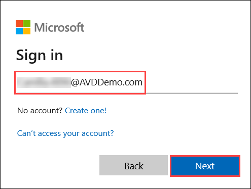

# Microsoft Defender ATP 

Microsoft 365 Defender is an integrated, cross-domain threat-detection and response solution. It can aid in the prevention, detection, investigation, and remediation of sophisticated threats across Microsoft 365. It also acts in the prevention of attacks by reducing your attack surface and eliminating persistent threats. Then, it automates threat resolution across domains by combining threat data for a quick and thorough response.

It also frees up defenders' time to focus on proactive hunting and other critical tasks such as developing custom tools and applying proprietary tactics and knowledge to better defend the organization.

Microsoft 365 Defender combines functionality from existing Microsoft security portals such as Microsoft Defender Security Center and Office 365 Security & Compliance Center. The security centre prioritises easy access to information, simpler layouts, and combining related information for easier use.

## Microsoft Defender Security Center 

1. Open a browser and sign in to the [Microsoft 365 Defender](https://security.microsoft.com/homepage).

2. On the homepage you will have Navigation pane (select the horizontal lines at the top left of the navigation pane to show or hide it). Here you can explore the portal by using the menu options given in each section

3. The homepage of the portal gives an overview of multiple items such as:

* **Microsoft Secure Score** is a metric that measures an organization's security posture, with a higher number of opportunities to improve it.
* **Users at risk** is basically a represntation of the information specific to the security risk of a user account.
* **Threat analytics** allows you to continuously assess and control your risk of being exposed to threats. Use the charts to quickly determine whether or not a device has mitigations.
* **Device compliance** chart helps you to review Intune device compliance status and troubleshoot compliance-related issues in your organization.
* **Active incidents**
* **Devices with active malware**
* **Discovered devices**
* **Microsoft 365 Defender Feed**

4. Now you will have alook to each of the section provided in the navigation pane and they are as follows:

* **Dashboards:**	In the Dashboard, you can Access the active automated investigations, active alerts, automated investigations statistics, devices at risk, users at risk, devices with sensor issues, service health, detection sources, and daily devices reporting dashboards.

* **Incidents:**	View alerts that have been combined as incidents in this section. You can also view the device which has caused the incident.

* **Devices Inventory:**	The Device Inventoy presents a list of devices that have been added to Defender for Endpoint, as well as basic information about them, as well as their exposure and risk levels.

* **Alerts queue:**	Here you can view alerts received by your workplace's devices.

* **Automated investigations:**	Displays automated investigations that have been conducted in the network, triggering alert, the status of each investigation and other details such as when the investigation started and the duration of the investigation.

* **Advanced hunting:**	Advanced hunting allows you to proactively hunt and investigate across your organization using a powerful search and query tool.

* **Reports:**	View graphs detailing the following:
1. Threat protection

2. Device health and compliance

3. Web protection

4. Vulnerable devices

* **Partners & APIs:**	Here you can see the supported partner connections, which improve the platform's detection, investigation, and threat intelligence capabilities. Also, you can view connected applications, the API explorer, an API usage overview, and data export settings.

* **Threat & Vulnerability management:**	View your Microsoft Secure Score for Devices, exposure score, exposed devices, vulnerable software, and take action on top security recommendations.

* **Evaluation and tutorials:**	Manage test devices, attack simulations, and reports. Learn and experience the Defender for Endpoint capabilities through a guided walk-through in a trial environment.

* **Service health:**	Provides information on the current status of the Defender for Endpoint service. You'll be able to verify that the service health is healthy or if there are current issues.

* **Configuration management:**	Displays on-boarded devices, your organizations' security baseline, predictive analysis, web protection coverage, and allows you to perform attack surface management on your devices.

* **Settings:**	Shows the settings you selected during onboarding and lets you update your industry preferences and retention policy period. You can also set other configuration settings such as permissions, APIs, rules, device management, IT service management, and network assessments.

## Onboard devices in Microsoft Defender ATP using Microsoft Intune

You can onboard any version of Windows that Microsoft Defender ATP supports. However, you must have a Windows 10 Enterprise E5 or Microsoft 365 Enterprise E5 license.

Microsoft Defender ATP has some additional requirements that Windows 10 devices need to meet:

* First, Microsoft Defender ATP requires the Diag Track service to be running in order to report cyber data. That’s the default Windows configuration, so just double-check that you haven’t turned it off.

* Microsoft Defender ATP requires an Internet connection. Its sensor can use about 5 megabytes each day to talk to the cloud service, plus additional bandwidth for files and investigation packages(which are sent only if you request them).

* Last, even if Windows Defender Antivirus isn’t the primary antimalware product, Microsoft Defender ATP relies on its passive mode to scan and provide information about files. 

Connecting Microsoft Defender ATP and Microsoft Intune enables scenarios like conditional access based on threat levels, and it also streamlines the onboarding process, since you don’t have to manually perfrom it. You turn that connection on in both places.

1. First, enable the Microsoft Intune connection in Microsoft Defender Security Center settings.

2. Open [Microsoft Defender Security Center](https://securitycenter.windows.com/dashboard) in a browser. From the navigation pane in the left select **Settings**, then select **Advanced features** and scroll down to **Microsoft Intune connection**.

3. Toggle the **Microsoft Intune connection** option to enable it

4. Second, turn on the Microsoft Defender ATP connection in Microsoft Intune. That control is in Device compliance, Microsoft Defender ATP. That control is in Device compliance, Microsoft Defender ATP

5. Connect to [Microsoft Endpoint Manager admin center](https://go.microsoft.com/fwlink/?linkid=2109431) and create a device configuration profile for Windows 10 or later that’s based on the Microsoft Defender ATP profile type. 

6. From the navigation pane in the left select **Devices**, then select **Configuration profiles**

7. You can add a new policy by selecting **+ Create Policy** and assign the profile to the devices you want to target.

8. Select the following options from drop downs:

* **Platform:** Windows 0 and later
* **Profile type** Templates
* **Template Name:** Microsoft Defender for Endpoint (Windows 10 Desktop) 
* Select **Create**

9. On the **Basics** tab, enter the following values for:

* **Name:** Microsoft Defender for Endpoint (Windows 10 Desktop)
* **Descritpion:** Microsoft Defender for Endpoint (Windows 10 Desktop) 
* Select **Next**

10. On the **Configuration settings** tab, select **Enable** for Expedite telemetry reporting frequency and select **Next**.

11. On the **Assignments** tab, fom Included groups secion select **+ Add all users** and **+ Add all devices** and select **Next**.

12. On the **Applicability Rules** tab, leave all on default and select **Next**.

13. On **Summary** page, review all the configurations and select **Create** to create the profiles.
 

14. Once you’ve deployed the device configuration profile, monitoring uptake is easy. The Microsoft Defender ATP compliance chart indicates how many devices have the agent and how many do not. This chart is in Device compliance, under Microsoft Defender ATP.

## Microsoft Defender ATP - Attack Simulation & Investigation Demos

1. Launch AVD Client on your local system and select **Subscribe**.

2. Enter the credentials as given below:
  
  * **Username** – **Camilia.4896@AVDDemo.com** and click on **Next**. 

    
  * **Password** – Enter the password and click on **Sign in**.

> **Note:** If there's a dialog box with More information required, select Skip for now option.
>    

>

3. Once signed in, the Full Desktop session will be presented to the user.

