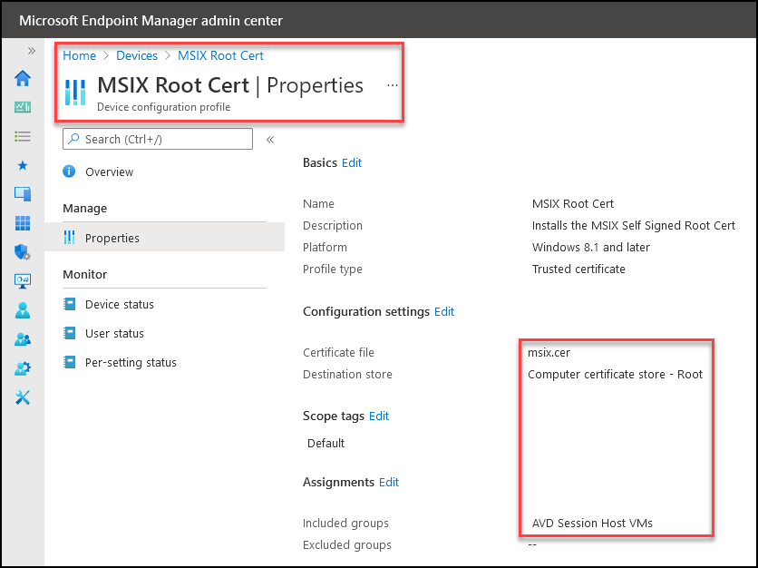
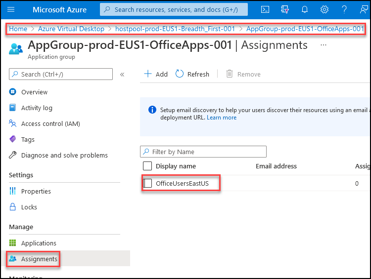
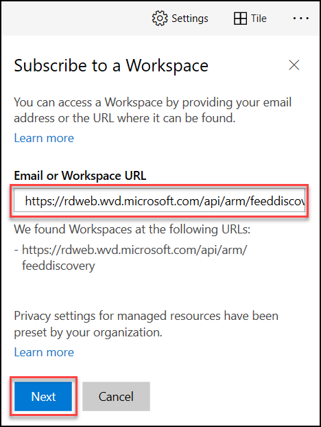
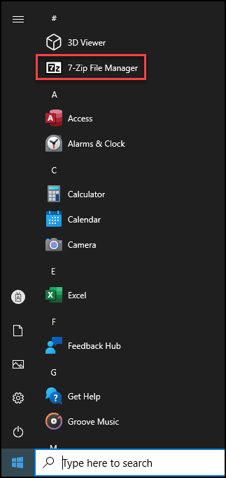
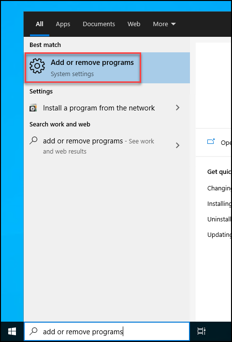
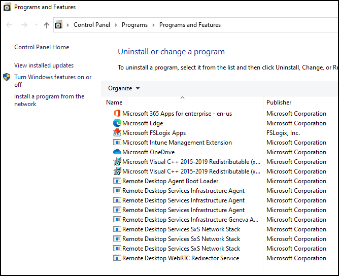

# **Demo 11: Azure Virtual Desktop - MSIX App Attach (7-Zip)**

MSIX app attach is a way to deliver MSIX applications to both physical and virtual machines. However, MSIX app attach is different from regular MSIX because it's made especially for Azure Virtual Desktop.

## Application delivery options in Azure Virtual Desktop

You can deliver apps in Azure Virtual Desktop through one of the following methods:

1. Put apps in a master image
2. Use tools like SCCM or Intune for central management
3. Dynamic app provisioning (AppV, VMware AppVolumes, or Citrix AppLayering)
4. Create custom tools or scripts using Microsoft and a third-party tool

## What does MSIX app attach do?

In a Azure Virtual Desktop deployment, MSIX app attach can:

1. Create separation between user data, the OS, and apps by using [MSIX containers](https://docs.microsoft.com/en-us/windows/msix/msix-container).
2. Remove the need for repackaging when delivering applications dynamically.
3. Reduce the time it takes for a user to sign in.
4. Reduce infrastructure requirements and cost.

# **Let's explore the setup and configurations for this Demo**

## Prerequisites that are already completed for this Demo

1. MSIX-packaged application (7-Zip) expanded into an MSIX image (VHD) that's uploaded into a file share:


2. AVD SessionHost VMs are provided "Storage File Data SMB Share Contributor" access permissions:


3. The MSIX Package is Signed by using a Self Signed Certificate. The same Certificate is being added to the Trusted Certificate Authorities Store on all the AVD Session Host VMs using MEM:



4. Added an MSIX image to the host pool and published MSIX app to an app group:


5. The Remote App Group, which now also includes the MSIX App, is already assigned to a User Group:



## **Task 1: Demonstrate using the MSIX App, 7-Zip through a Desktop Session**

In this demo, we will access the Desktop using a AVD Client and launch an MSIX App 7-Zip.

1. Launch AVD Client on your JumpVM.

>**Note:** The AVD Client must be already logged in during the previous demo login; follow below steps to login using multiple accounts.

2. In AVD desktop client click on **Subscribe with URL**.

   

3. - Enter the below feed URL and click **Next**.
```
https://rdweb.wvd.microsoft.com/api/arm/feeddiscovery
```   

   

4. - Enter the username as below and click **Next**.
```
Emma.4896@AVDDemo.com
```   
   
   - Enter the password <inject key="demo Admin Password" /> and click **Sign in**.

5. The RemoteApps, 7-Zip MSIX App, along with the Session Desktops published to the logged in user will show up, click on **SessionDesktop**.

    

6. Click on Start and notice the 7-Zip App showing up in the Start Menu:

    

7. Now let us go to Add or remove programs:

    

8. Notice that 7-Zip shows up in the rich settings as an installed app, Now click on *Programs and features*:

    

9. But in the classic "Programs and Features" window, the App is not installed:

    

10. Launch **PowerShell** as an Admin, Enter your AVD Presenter UserName and Password and run **DiskMgmt.msc** command to bring up the Disk Manager.
  - Username: AVDPresentor01@AVDDemo.com
  - Password: **<inject key="Demo Admin Password" />**

11. Highlight how the 7-Zip VHD is mounted to support the MSIX App 7-Zip. This VHD contains the MSIX App Data for the Application:

    