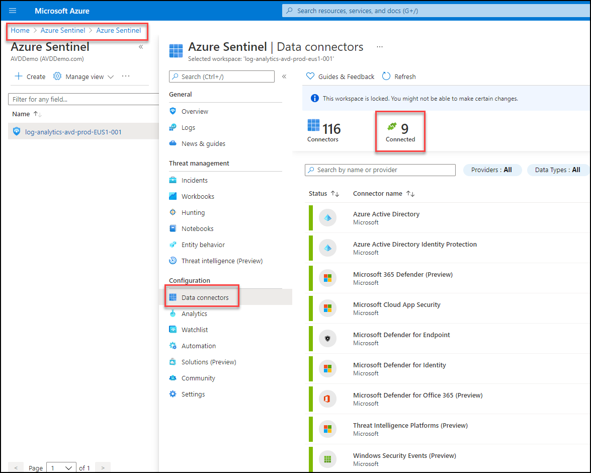

# **Demo 12: Azure Sentinel**

## What is Azure Sentinel?

Microsoft Azure Sentinel is a scalable, cloud-native, security information event management (SIEM) and security orchestration automated response (SOAR) solution. Azure Sentinel delivers intelligent security analytics and threat intelligence across the enterprise, providing a single solution for alert detection, threat visibility, proactive hunting, and threat response.

Azure Sentinel is your birds-eye view across the enterprise alleviating the stress of increasingly sophisticated attacks, increasing volumes of alerts, and long resolution time frames.

- **Collect data at cloud scale** across all users, devices, applications, and infrastructure, both on-premises and in multiple clouds. 

- **Detect previously undetected threats**, and minimize false positives using Microsoft's analytics and unparalleled threat intelligence. 

- **Investigate threats with artificial intelligence**, and hunt for suspicious activities at scale, tapping into years of cyber security work at Microsoft. 

- **Respond to incidents rapidly** with built-in orchestration and automation of common tasks.

To on-board Azure Sentinel, you first need to enable Azure Sentinel, and then connect your data sources. Azure Sentinel comes with a number of connectors for Microsoft solutions, available out of the box and providing real-time integration, including Microsoft 365 Defender (formerly Microsoft Threat Protection) solutions, Microsoft 365 sources (including Office 365), Azure AD, Microsoft Defender for Identity (formerly Azure ATP), Microsoft Cloud App Security, Azure Defender alerts from Azure Security Center, and more.

## Global prerequisites

- Active Azure Subscription, if you don't have one, create a [free account](https://azure.microsoft.com/free/?WT.mc_id=A261C142F) before you begin.

- Log Analytics workspace. Learn how to [create a Log Analytics workspace](https://docs.microsoft.com/en-us/azure/azure-monitor/logs/quick-create-workspace). For more information about Log Analytics workspaces, see [Designing your Azure Monitor Logs deployment](https://docs.microsoft.com/en-us/azure/azure-monitor/logs/design-logs-deployment).

- To enable Azure Sentinel, you need contributor permissions to the subscription in which the Azure Sentinel workspace resides.

- To use Azure Sentinel, you need either contributor or reader permissions on the resource group that the workspace belongs to.

- Additional permissions may be needed to connect specific data sources.

- Azure Sentinel is a paid service. For pricing information see [About Azure Sentinel](https://go.microsoft.com/fwlink/?linkid=2104058).

## **Task 1: Demo and Walkthrough of Azure Sentinel**

1. Sign in to the Azure portal and search for and select Azure Sentinel.

2. Click on **log-analytics-avd-prod-EUS1-001**

3. Click on **Data Connectors** and highlight the Connected Data connectors

4. Click on **Azure Active Directory** and then click on **Open connector page**

