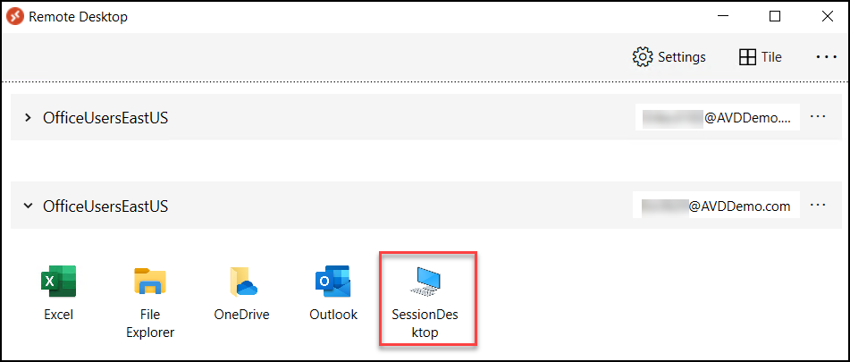
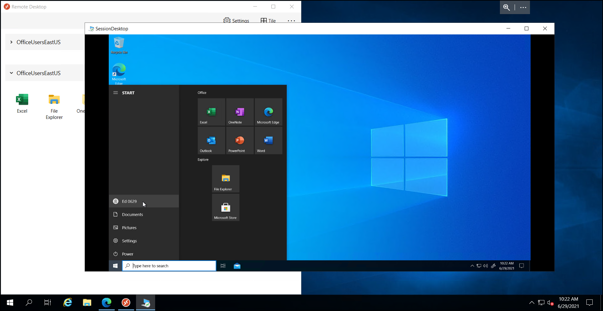

# **Demo 13: Microsoft Defender for Endpoint Attack simulation - Automated investigation (backdoor)**

## Introduction to the automated incident response scenario

In this scenario, we simulate an attack that triggers the new Microsoft Defender for Endpoint automated investigation capabilities. This capability automates the SOC attack response: triage, investigate, and remediate. During the response, automated investigation identifies and removes known attack artifacts from the affected device. It can also automatically pivot to other devices that may be affected and apply the same response actions.

To trigger automated investigation, we provide a attack lure document.

**Document drops backdoor:** Scenario simulates attacks that are launched using a socially engineered lure document in a spear-phishing email. The lure is designed to ensure that the receiver doesn’t suspect a thing and unwittingly opens the document.

The document, however, is weaponized with crafted macro code that silently drops and loads an executable file onto the device. Although this simulation uses a document that drops a benign executable, the executable behaves as if it is a backdoor attempting to gain persistence—it writes to a registry Run key and creates a scheduled task, both commonly known autostart extensibility points (ASEPs).

The attack simulation ends when the ASEPs are created. In the real world, however, the attacker is expected to use the implanted backdoor to perform other actions within the compromised network, such as moving laterally

## **Task 1: Run the simulation**

Login to any AVD Session host using AVD Client and run Full Desktop Session.

1. Launch AVD Client on your JumpVM.

>**Note:** The AVD Client must be already logged in during the previous demo login; follow below steps to login using multiple accounts.

2. In AVD desktop client click on **Subscribe with URL**.

   

3. - Enter the below feed URL and click **Next**.
       ```
       https://rdweb.wvd.microsoft.com/api/arm/feeddiscovery
       ```   

   

4. - Enter the username as below and click **Next**.
       ```
       Eva.4896@AVDDemo.com
       ```   
   
   - Enter the password <inject key="demo Admin Password" /> and click **Sign in**.

5. The RemoteApps, along with the Session Desktops published to the logged in user will show up, click on **SessionDesktop**.

   
   

6. Enter the credentials for *Eva.4896@AVDDemo.com* and click on **OK**.

7. Once signed in, the Full Desktop session will be presented.

   

8. Open Edge Browser and download the attack lure document by navigating to the below URL:

    **- ["RS4_WinATP-Intro-Invoice.docm" attack lure document file can be downloaded from here](https://raw.githubusercontent.com/Eddevinc/AVD-STU-DEMO/7f84c432293d97ee560e93d1dc4648cf6f79048c/media/RS4_WinATP-Intro-Invoice.docm)**

    

9. Double-click the downloaded document. Microsoft Word will prompt for a password to open the document.
    To open the password-protected document, use the password **WDATP!diy#**

    

10. Click **Enable Editing** if the document opens in Protected View. If you see a subsequent security
warning about macros being disabled, click **Enable Content**.

    

    

11. Click **OK** on the warning

    

12. A few seconds later, a new file WinATP-Intro-Backdoor.exe, which represents the backdoor, is dropped onto the Desktop folder by a PowerShell script launched from the document’s malicious macro.

13. The script goes on to create a scheduled task to launch the backdoor at a predefined time. This mechanism of indirect process launch is sometimes used for stealth, as it is harder to trace back to the document.

14. When the backdoor is launched, it creates an autostart entry under the registry Run key, allowing it to stay persistent by starting automatically with Windows. A Command Prompt window opens, indicating that the simulated backdoor is running.

15. The attack simulation ends here. A real attacker, if successful, would likely continue to scan for information, send collected reconnaissance information to a command-and-control (C&C) server, and use this information to move laterally and pursue other attractive targets.
Next, let’s review and investigate the Defender for Endpoint alerts that surfaced the simulated attack.

>   **Note:** Alerts should start to appear 15-30 minutes after the simulated backdoor is launched.

## **Task 2: Review and investigate the Defender for Endpoint alerts that surfaced the simulated attack**

We will now be signing into https://security.microsoft.com/alerts using the AVD Presentor Account

1. In JumpVM launch Edge browser and navigate to Defender Portal using following URL.     
```
https://security.microsoft.com/alerts
```				
2. Sign in into the portal using the below credentials.
- Username:
```
AVDPresentor01@AVDDemo.com
```
- Password: **<inject key="Demo Admin Password" />**


>**Note:** If you are asked for MFA, Scan the below QR Code on your phone's Authenticator App and use the 6 digit code for MFA Authentication.
>

>

3. Highlight the **Alerts** and talk about the Auto initaited Investigations:

    

4. Highlight the **Incidents** and talk about the Auto initaited Investigations and Auto remediations:

    

5. Highlight the **Action Center** and talk about the Auto initaited Investigations and Auto remediations:

    